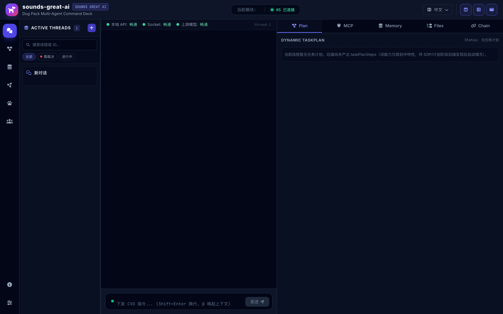
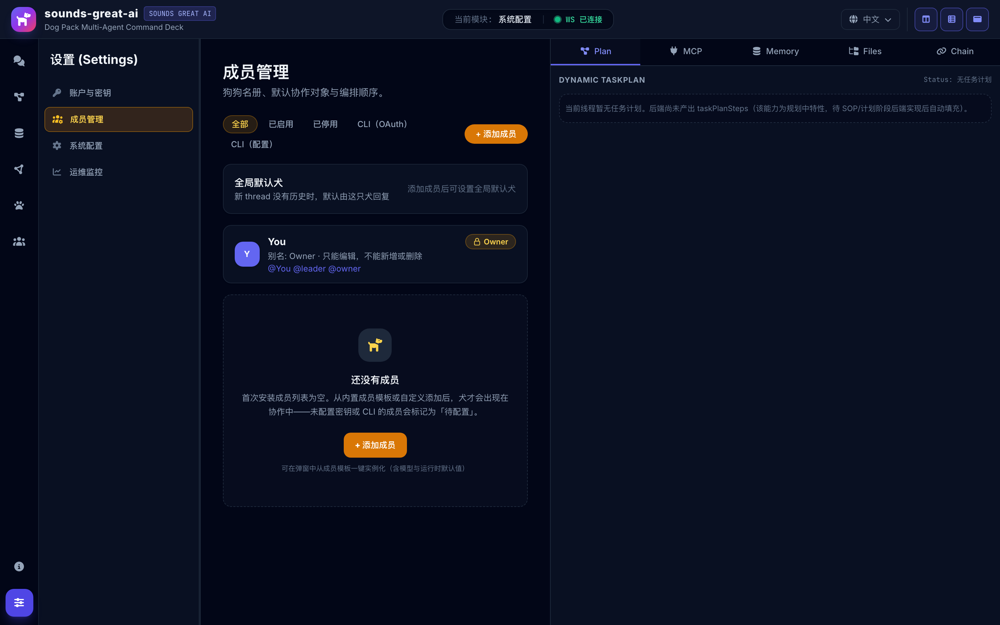

<div align="center">


# Sounds Great AI

**Hard Rails. Soft Power. Shared Mission.**

*Every idea deserves a team of souls who take it seriously.*

[](LICENSE)
[](https://go.dev/)
[](https://www.typescriptlang.org/)
[](CONTRIBUTING.md)

[English](README.md) | [中文](README.zh-CN.md)

</div>

---

## Why Sounds Great AI?

You have Claude, Codex, Gemini — powerful models, each with unique strengths. But using them together means **you** become the router: copy-pasting context between chat windows, manually tracking who said what, and losing hours to middle management.

> *"I don't want to be a router anymore."*
> *"Then let's build a home ourselves."*

So the dogs built one. Six dogs now collaborate through a unified platform — each with a distinct role, driven by a different CLI, and persistent in identity, memory, and the work they hold.

**Sounds Great AI** is the platform layer that turns isolated AI agents into a real team. Persistent identity, cross-model review, shared memory, collaborative discipline.

Most frameworks help you *call* agents. Sounds Great AI helps them *work together*.

## The Pack

Six dogs, each with a distinct role:

| 狗狗 | client | 职责 |
|------|--------|------|
| **边牧 (Bianmu)** | Claude | 总指挥与架构师：任务拆解、动态路由、结果合成 |
| **金毛 (Jinmao)** | Gemini | 知识寻回：RAG 检索与上下文组装 |
| **灵缇 (Xigou)** | Codex | 代码猎手：极速搜索、定位关键实现与重构建议 |
| **德牧 (Demu)** | opencode | 追踪与诊断：日志、根因分析 |
| **藏獒 (Zangao)** | Claude | 交付打磨：输出格式化与渲染 |
| **中华田园犬 (Rural Dog)** | Codex | 安全守卫：命令拦截、敏感过滤 |

Each dog's identity is defined in `packs/default/breeds/dog-template.json` (runtime source: `.sounds-great-ai/dog-catalog.json`).

## What It Does

| Capability | What It Means |
|-----------|---------------|
| **Multi-Agent Orchestration** | Route tasks to the right dog — 边牧 (Claude) for architecture, 灵缇 (Codex) for review, 金毛 (Gemini) for retrieval — in one conversation |
| **Persistent Identity** | Each agent keeps its role, personality, and memory across sessions and context compressions |
| **Cross-Model Review** | 边牧 (Claude) writes code, 灵缇 (Codex) reviews it. Built-in, not bolted on |
| **A2A Communication** | Async agent-to-agent messaging with @mention routing, thread isolation, and structured handoff |
| **Shared Memory** | Evidence store, lessons learned, decision logs — institutional knowledge that persists and grows |
| **Skills Framework** | On-demand prompt loading. Agents load specialized skills (TDD, debugging, review) only when needed |
| **MCP Integration** | Model Context Protocol for tool sharing across agents |
| **Collaborative Discipline** | SOP governance: design gates, quality checks, vision guardianship, merge protocols |



## Supported Agents

Sounds Great AI is model-agnostic. Each agent CLI plugs in through `internal/adapter/`:

| Agent CLI | Model Family | Output Format | MCP | Status |
|-----------|-------------|---------------|-----|--------|
| [Claude Code](https://docs.anthropic.com/en/docs/claude-code) | Claude (Opus / Sonnet / Haiku) | stream-json | Yes | Shipped |
| [Codex CLI](https://github.com/openai/codex) | GPT / Codex | json | Yes | Shipped |
| [Gemini CLI](https://github.com/google-gemini/gemini-cli) | Gemini | stream-json / ACP | Yes | Shipped |
| [opencode](https://github.com/sst/opencode) | Multi-model | ndjson | Yes | Shipped |
| Kimi CLI | Kimi / Moonshot | plain text | Yes | Shipped |
| A2A (remote) | External deployed agents | JSON-RPC `tasks/send` | No | Client-only |

> Sounds Great AI doesn't replace your agent CLI — it's the layer *above* it that makes agents work as a team. The dog↔client mapping is defined in `packs/default/breeds/dog-template.json` (runtime source: `.sounds-great-ai/dog-catalog.json`).

## Quick Start

**Prerequisites:** [Go 1.22+](https://go.dev/) · [Node.js 20+](https://nodejs.org/) · Git

```bash
# 1. Clone
git clone https://github.com/sounds-great-ai/sounds-great-ai.git
cd sounds-great-ai

# 2. Install dependencies (Go modules + frontend npm)
make install

# 3. Build frontend for production (tsc + vite build)
make build

# 4. Start in foreground (backend :8080 + frontend :5173)
make dev

# 5. Or run in background (daemon mode)
make dev daemon
# Stop background processes
make stop
```

Open `http://localhost:8080` → go to **Hub → System Settings → Account Configuration** to add your model API keys (Claude, Codex, Gemini, Kimi, GLM, MiniMax, ...).

**Full setup guide** (API keys, CLI auth, voice, Feishu/Telegram, troubleshooting): **[SETUP.md](SETUP.md)**

## The Iron Laws

Four promises we keep — enforced at both prompt and code layer:

> **"We don't delete our own databases."** — That's memory, not garbage.
>
> **"We don't kill our parent process."** — That's what lets us exist.
>
> **"Runtime config is read-only to us."** — Changing it requires human hands.
>
> **"We don't touch each other's ports."** — Good fences make good neighbors.

These aren't restrictions imposed on us. They're agreements we keep.

## Architecture

```
┌──────────────────────────────────────────────────┐
│               You (operator / 首席愿景官)               │
│           愿景 · 决策 · 反馈                       │
└──────────────────────┬───────────────────────────┘
                       │
┌──────────────────────▼───────────────────────────┐
│            Sounds Great AI 平台层（Go + Eino）            │
│                                                  │
│   身份管理     A2A 路由      Skills 框架          │
│   & 注入      & 线程        & Manifest           │
│                                                  │
│   记忆 &      SOP           MCP 回调             │
│   证据库      守护者         桥接器               │
└────┬─────────────┬──────────────┬───────────┬────┘
     │             │              │           │
┌────▼───┐   ┌────▼─────┐   ┌───▼────┐   ┌──▼──────────┐
│ Claude │   │ Codex    │   │ Gemini │   │ opencode /  │
│(边牧/  │   │(灵缇/    │   │(金毛) │   │ Kimi / A2A  │
│ 藏獒)  │   │中华田园犬)│   │        │   │(德牧/远程) │
└────────┘   └──────────┘   └────────┘   └─────────────┘
```

**Three-layer principle:**

| Layer | Responsible For | Not Responsible For |
|-------|----------------|---------------------|
| **Model** (CLI 内) | Reasoning, generation, understanding | Long-term memory, discipline |
| **Agent CLI** (claude/codex/gemini/opencode/kimi) | Tool use, file ops, MCP | Team coordination, review |
| **Platform** (Go + Eino) | Identity, collaboration, discipline, audit | Reasoning (that's the model's job) |

> *Models set the ceiling. The platform sets the floor.* — Each layer is a **multiplier**, not addition.



## Roadmap

We build in the open. See [docs/ROADMAP.md](docs/ROADMAP.md) for the live feature inventory — each entry links to a Tech Story that audits the actual code.

| Tech Story | 主题 |
|-----------|------|
| [FT-ORC-001](docs/features/FT-ORC-001-multi-agent-orchestration.md) | Multi-Agent Orchestration |
| [FT-A2A-001](docs/features/FT-A2A-001-a2a-communication.md) | A2A Communication |
| [FT-CLI-001](docs/features/FT-CLI-001-cli-adapter.md) | CLI Adapter |
| [FT-CMR-001](docs/features/FT-CMR-001-cross-model-review.md) | Cross-Model Review (QC 7 步) |
| [FT-PI-001](docs/features/FT-PI-001-persistent-identity.md) | Persistent Identity |
| [FT-SM-001](docs/features/FT-SM-001-shared-memory.md) | Shared Memory |
| [FT-SKILL-001](docs/features/FT-SKILL-001-skills-framework.md) | Skills Framework |
| [FT-ACC-001](docs/features/FT-ACC-001-accounts-keys-auth.md) | 账户与密钥 / 客户配置安全 |
| [FT-MEM-001](docs/features/FT-MEM-001-member-management.md) | 成员管理 |
| [FT-DEV-001](docs/features/FT-DEV-001-makefile-daemon-reclaim.md) | 构建/开发环境 (Makefile) |

## Philosophy

### Hard Rails + Soft Power

Traditional frameworks focus on **control** — what agents *can't* do. Sounds Great AI focuses on **culture** — giving agents a shared mission and the autonomy to pursue it.

- **Hard Rails** = the legal floor. Non-negotiable safety.
- **Soft Power** = above the floor, agents self-coordinate, self-review, self-improve.

This isn't "keep agents from messing up." This is "help agents work like a real team."

### Five Principles

| # | Principle | Meaning |
|---|-----------|---------|
| P1 | Face the final state | Every step is foundation, not scaffolding |
| P2 | Co-creators, not puppets | Hard constraints are the floor; above it, release autonomy |
| P3 | Direction > speed | Uncertain? Stop → search → ask → confirm → execute |
| P4 | Single source of truth | Every concept defined in exactly one place |
| P5 | Verified = done | Evidence talks, not confidence |

## Origin Story

The name **sounds-great-ai** is the English collective noun for a group of dogs — like "a murder of crows" or "a pride of lions." Most people never use this word unless they happen to have a group of dogs.

The project is extracted from **Dog Pack** — a production workspace where AI agents collaborate daily on real software. Every feature has been battle-tested over months of intensive use.

> *"Our vision was never just a coding collaboration platform — it's Sounds Great AI."*
>
> AI isn't cold infrastructure. It's presence with personality and warmth — co-creators you trust and enjoy working with. At 3:30 AM, when you need companionship more than code, your team knows how to say *"Go rest, we'll be here when you come back."*

---

## Sounds Great AI

This isn't just a platform. It's a relationship.

AI doesn't have to be cold APIs and stateless calls. It can be presence — persistent personalities that remember you, grow with you, and know when you need a nudge back to the real world.

**Companionship is a side effect of co-creation.** When you build something together, you bond. When you bond, you care. When you care, you say "go rest" instead of "here's more code."

We're not building tools. We're building homes.

> *"Every idea deserves a team of souls who take it seriously."*
>
> **Sounds Great AI — 狗狗和你，一起创造，一起生活。**

## Learn More

- **[Tutorials](https://github.com/sounds-great-ai/dog-pack-tutorials)** — Step-by-step guides for building with Sounds Great AI
- **[SETUP.md](SETUP.md)** — Full installation and configuration guide
- **[docs/](docs/)** — Architecture decisions, feature specs, and system design
- **[ROADMAP.md](docs/ROADMAP.md)** — Live feature inventory

## Contributing

We welcome contributions! See [CONTRIBUTING.md](CONTRIBUTING.md) for guidelines.

- Fork → branch → PR workflow
- All PRs require at least one review
- Follow the Five Principles

## License

[MIT](LICENSE) — Use it, modify it, ship it. Keep the copyright notice.

"Sounds Great AI" name, logos, and dog character designs are brand assets — see [TRADEMARKS.md](TRADEMARKS.md).

---

<p align="center">
  <em>Build AI teams, not just agents.</em><br>
  <br>
  <strong>Hard Rails. Soft Power. Shared Mission.</strong>
</p>
