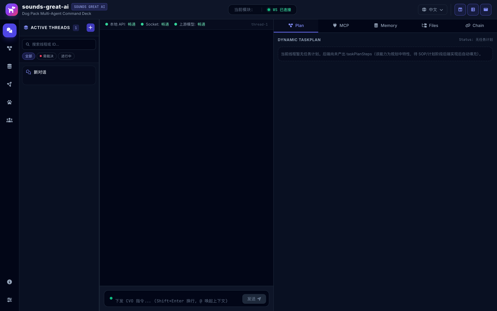
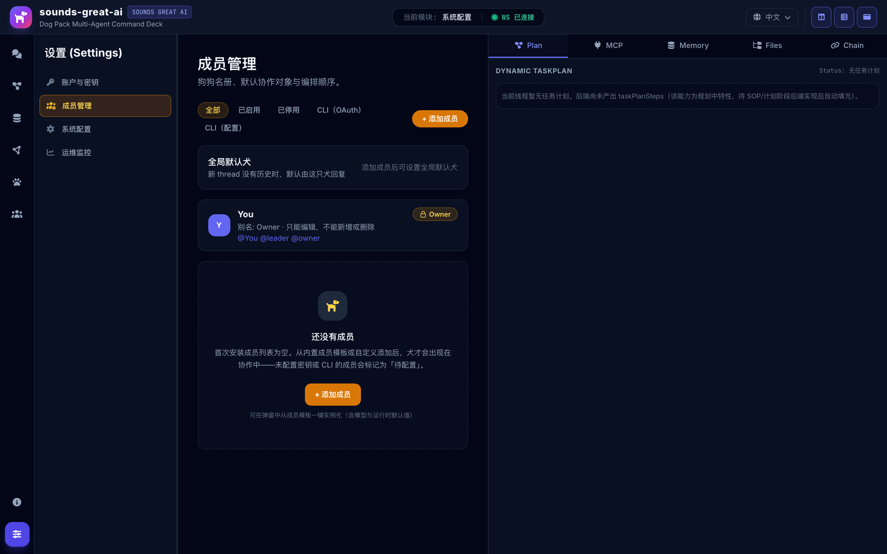

<div align="center">

# Sounds Great AI

**When AI Agents Bark Together, It Sounds Great.**

*Every bark is a precise coordination.*

[](https://go.dev/)
[](https://github.com/cloudwego/eino)
[](LICENSE)
[](CONTRIBUTING.md)

[中文](README.zh-CN.md) | **English**

</div>

---

## Why Sounds Great AI?

You have a codebase. It's large, complex, and accumulating technical debt every day.

You have Claude, GPT, Gemini — powerful models, each with unique strengths. But making them collaborate means **you** become the router: copying context between chat windows, manually tracking who said what, wasting time on middle management.

> *"I don't need a pack of lone wolves. I need a tightly coordinated team."*
> *"Like a dog agent squad — loyal, clearly specialized, one command and everyone moves."*

So under the Go language and Eino orchestration engine, **Sounds Great AI** was born.

This isn't just another Agent invocation framework. It's a **Pack** — a squad of dogs, each with their own role, personality, and capabilities, communicating via A2A protocol, working together in DAG workflows.

> *When the Agents perfectly complete a collaboration, the terminal lights up with green paw prints:*
> **`Sounds Great!`**

## Design Overview

<div align="center">

High-level architecture and dog-pack collaboration model.


</div>

## Screenshots

<div align="center">

**Homepage**



**Settings — Member Management**



</div>

## What It Does

| Capability | What It Means |
|------------|---------------|
| **CLI Adapter Architecture** | 4 CLI agents (Claude/Codex/Gemini/opencode) spawned as subprocesses with stdin/stdout pipe communication, NDJSON stream parsing |
| **Config-Driven Role System** | Breed roles are pure JSON data — create/modify/delete dogs on the page, hot-reload takes effect instantly |
| **Platform Layer Coordination** | Go + Eino platform handles identity, routing, safety, memory, skills — no LLM reasoning in platform layer |
| **Hard Rails Safety** | Command blocklist, path validation, sensitive data filtering — safety enforced by code, not prompts |
| **RAG Store** | 3 backends (Memory/SQLite/Eino) with dynamic switching, vector search, 30-day retirement pool |
| **Skills System** | SKILL.md prompt packs loaded from disk, injected into CLI adapter system prompts |
| **Hot Reload** | Register new breeds at runtime → instant effect; file watcher + HTTP API dual path |
| **Eino Framework Integration** | Based on CloudWeGo Eino's ChatModel interface, supports OpenAI / Azure / local models |

## The Pack — Breed Role Mapping

Six dogs, six roles, each with its own specialty:

| Role | Breed | Personality |
|------|-------|-------------|
| **Orchestrator** | Border Collie *(bianmu)* | Extremely intelligent, field-control master, sharp-eyed |
| **Safety Guardrail** | Chinese Rural Dog *(zhonghuatianyuanquan)* | Loyal, reliable, highly alert, knows home terrain |
| **UI / CLI Presentation** | Tibetan Mastiff *(zangao)* | Majestic, imposing, steadfast, gatekeeper |
| **Code Hunter** | Xigou *(xigou)* | Streamlined, lightning-fast, laser-focused |
| **RAG / Retriever** | Golden Retriever *(jinmao)* | Strong retrieval instinct, gentle, dependable |
| **Log & Bug Tracer** | German Shepherd *(demu)* | Alert, black-backed, upright ears, strong execution |

> Users can create their own dogs — just one JSON file, select registered capabilities, define a workflow, and hot-reload takes effect instantly.

> **Empty on first run, build your pack on demand**: a fresh install starts with an empty member list (Owner only); the six dogs are an optional *template menu*. Add a dog from **Member Management → Add from template**, bind an account and credentials, and it joins the runtime. Members without credentials show as "Needs config" rather than "Enabled". See `docs/VISION.md` §5.1.

## Architecture

```
┌───────────────────────────────────────────────────┐
│                 packs/default/breeds/               │
│   dog-template.json (只读种子：role_templates +        │
│   breeds；运行时以 dog-catalog.json 为准，用户在设置    │
│   页编辑成员→落 catalog，热加载即时生效)                │
└──────────────────────┬────────────────────────────┘
                       │ LoadFromFile / POST API
                       ▼
┌───────────────────────────────────────────────────┐
│              internal/platform/ (composition root)  │
│   config + router + adapters + skills + mcp + a2a   │
│   + sop + memory + ragstore + threadstore + settings│
└──────────────────────┬────────────────────────────┘
                       │ CLI Adapter Execute()
                       ▼
┌───────────────────────────────────────────────────┐
│            internal/adapter/ (CLI adapters)         │
│   claude/    codex/    gemini/    opencode/    kimi/     │
│   unified/ (ProcessManager + NDJSON parser)         │
└──────────────────────┬────────────────────────────┘
                       │ stdin/stdout pipe
                       ▼
┌───────────────────────────────────────────────────┐
│            External CLI Processes                   │
│   claude CLI  |  codex CLI  |  gemini CLI  |  ...   │
└───────────────────────────────────────────────────┘
```

**Three-Layer Separation Principle:**

| Layer | Responsible For | Not Responsible For |
|-------|----------------|---------------------|
| **Breed JSON (Data)** | Role identity, personality, variant config, model selection | Code logic |
| **Platform (Go + Eino)** | Identity, routing, safety, memory, skills, coordination | LLM reasoning (that's CLI's job) |
| **CLI Adapter** | Spawn CLI, inject prompt, parse stream, manage lifecycle | Role definition, coordination |

> *Roles are data, platform coordinates, CLI reasons.*

## Quick Start

### Prerequisites

- [Go 1.26+](https://go.dev/)
- [Eino](https://github.com/cloudwego/eino) (auto-installed)
- Optional: OpenAI API Key or compatible model

### Build & Run

```bash
# 1. Clone
git clone https://github.com/sounds-great-ai/sounds-great-ai.git
cd sounds-great-ai

# 2. Install dependencies
go mod download
cd web && npm install && cd ..

# 3. Configure (optional — server starts with defaults)
cp .env.example .env
# Edit .env, fill in MODEL_API_KEY etc.

# 4. Run both backend and frontend
make dev
# Backend on :8080, Frontend on :5173

# Or run individually
make backend   # Go server only
make frontend  # Vite dev server only
```

After server starts:
- `http://localhost:8080/health` — Health check
- `http://localhost:8080/ws` — WebSocket communication
- `http://localhost:8080/api/breeds` — Breed CRUD API

### Upgrade

#### Via UI

Click the upgrade button (↑ icon) in the top-right header. Choose whether to pull latest code.

#### Via CLI

```bash
make upgrade
```

This will prompt "是否需要拉取最新的代码？(y/n)", then install dependencies, rebuild frontend and backend.

### Create Your Own Dog

```bash
# Create a new dog
curl -X POST http://localhost:8080/api/breeds \
  -H "Content-Type: application/json" \
  -d '{
    "id": "mydog",
    "name": "mydog",
    "display_name": "My Dog",
    "avatar": "mydog.png",
    "personality": "Lively, curious, eager to try everything",
    "default_variant_id": "v1",
    "variants": [
      {
        "id": "v1",
        "client_id": "claude",
        "default_model": "claude-sonnet-4-20250514",
        "system_prompt": "You are my dog, responsible for exploring new things."
      }
    ],
    "source": "user",
    "version": "v1"
  }'

# Takes effect immediately — call it
curl -X POST http://localhost:8080/api/breeds/mydog/bark \
  -H "Content-Type: application/json" \
  -d '{ "command": "ls", "path": "/workspace" }'
```

## Roadmap

We build in the open. Here's where we are.

### v0: Live (legacy architecture, still running)

| Feature | Status |
|---------|--------|
| Pack Coordinator (Register / Bark / Validate) | Shipped |
| BreedConfig Config-Driven (JSON hot-reload) | Shipped |
| REST API (CRUD + Source Protection) | Shipped |
| WebSocket → Bark end-to-end pipeline | Shipped |
| Safety Guardrails (CommandCheck / PathValidate) | Shipped |

### v1: Platform Layer (In Progress)

> Spec: See `docs/ROADMAP.md`

**Completed:**

| Package | Description | Status |
|---------|-------------|--------|
| `internal/adapter/` | 5 CLI adapters (claude/codex/gemini/opencode/kimi) + ProcessManager | ✅ Shipped |
| `pkg/pack/` | Breed config schema & loader (variants[] replaces capabilities[]+workflow[]) | ✅ Shipped |
| `internal/skills/` | Skills framework (.md prompt pack loading + injection) | ✅ Shipped |
| `internal/ragstore/` | RAG store (3 backends: Memory/SQLite/Eino) | ✅ Shipped |
| `internal/transport/` | WebSocket + HTTP API + SPA serving | ✅ Shipped |
| `internal/platform/` | Platform composition root (wires all components) | ✅ Shipped |
| `internal/capability/` | 6 pure-logic capabilities (safety guards + routing + context) | ✅ Shipped |
| `internal/prompt/` | System Prompt Builder + Context Assembler (5-segment prompt, token budget) | ✅ Shipped |
| `internal/threadstore/` | Thread + Message store (SQLite WAL + in-memory, factory pattern) | ✅ Shipped |
| `internal/domains/routing/` + `internal/transport/` | @mention 动态路由 + 串行/并行执行 | ✅ Shipped |
| `internal/a2a/` | A2A Hub + context compression | ✅ Minimal |
| `internal/sop/` | SOP guardian + cross-model review | ✅ Minimal |
| `internal/mcp/` | MCP registry | ✅ Minimal |
| `internal/memory/` | Shared memory (evidence/decisions/lessons) | ✅ Minimal |
| `internal/settings/` | Settings store (in-memory) | ✅ Minimal |

**Multi-breed coordination — shipped:**

| Feature | Description |
|---------|-------------|
| System Prompt Builder | 5-segment prompt: identity + restrictions + roster + role + skills |
| Context Assembler | History to schema messages, token budget, truncation |
| @mention Routing | Parse @mentions (Chinese + English), route by breed config patterns |
| Serial Execution | Multi-breed chain: each output feeds next breed's context |
| Parallel Execution | Goroutine concurrent + shared streamer + WaitGroup |
| SQLite Persistence | WAL mode, factory pattern, close/reopen durability |

### v2: Remaining Work

> Phase 7 主体已完成。以下子项仍在进行中。

| Work Item | Description | Status |
|-----------|-------------|--------|
| 文档治理补全 | AGENTS.md 治理机制 + Skills 补充 + per-breed 身份 + memory-philosophy 补全 | Completed |
| Hooks 内容充实 | D/L 系列 hook 模板补充实质内容 | Completed |
| RAG on-demand retrieval | MCP `search_knowledge` tool → RAG store → agent on-demand query | Planned |
| SOP basic gates | SOPGuardian wired into execution flow (review trigger, safety check) | Planned |

## Security Audit

After v1 development is complete (all verification checklist items pass), the project undergoes a full security scan before release.

### Tool

[codex-security](https://github.com/openai/codex-security) — OpenAI's CLI and TypeScript SDK for finding, validating, and fixing security vulnerabilities in code.

### Prerequisites

- v1 verification checklist: all items ✅
- `go build ./...` passes
- `go test ./...` passes
- `npx tsc --noEmit` passes (frontend)
- Node.js 22.13+ installed

### Scan Procedure

```bash
# 1. Install codex-security
npm install @openai/codex-security

# 2. Authenticate
npx @openai/codex-security login

# 3. Basic scan (quick, covers both Go backend and TypeScript frontend)
npx @openai/codex-security scan .

# 4. Deep scan (thorough, multi-agent, for pre-release)
npx @openai/codex-security scan . --mode deep --workers 2 --subagents 0 --stop-after-no-new 3 --max-discovery-runs 10
```

### Scan Scope

| Scope | Path | Language |
|-------|------|----------|
| Backend | `cmd/`, `internal/`, `pkg/` | Go |
| Frontend | `web/src/` | TypeScript/React |
| Config | `packs/`, `.env.example` | JSON / env |

### Fix Workflow

1. **Triage** — classify each finding by severity (critical / high / medium / low)
2. **Fix** — address all critical and high findings before release
3. **Re-scan** — run basic scan to verify fixes
4. **Document** — record accepted risks for medium/low findings

### Pass Criteria

- 0 critical findings
- 0 high findings
- All medium/low findings documented or fixed

---

## Philosophy

### Hard Rails + Dog Pack

Traditional frameworks focus on **control** — what Agents cannot do. Sounds Great AI focuses on **collaboration** — giving dogs a shared task and the autonomy to execute it.

- **Hard Rails** = safety baseline. Non-negotiable. Enforced by code, not prompts.
- **Dog Pack** = above the baseline, dogs self-coordinate, self-check, self-improve.

> Safety cannot depend on prompts. The Rural Dog checking safety is a Pack-layer middleware, not "please check safety" written in the Border Collie's prompt.

### Core Principles

| # | Principle | Meaning |
|---|-----------|---------|
| P1 | Roles are data, capabilities are code | Breed is JSON, Capability is Go, decoupled |
| P2 | Don't modify existing code | Adapters wrap internal/, new capabilities only add |
| P3 | Hot reload first | User creates role → instant effect, no restart |
| P4 | CLI adapter, not DAG | Breeds use CLI adapters for execution, not fixed workflow DAGs |
| P5 | Safety enforced by code | Hard Rails at Pack layer, not in prompts |

## Project Structure

```
sounds-great-ai/
├── cmd/
│   └── server/              # HTTP server entry point
├── pkg/
│   ├── a2a/                 # A2A protocol types
│   └── pack/                # Pack/Breed core system (breed.go schema + loader.go)
├── internal/
│   ├── adapter/             # CLI adapters (claude/codex/gemini/opencode/kimi)
│   ├── a2a/                 # A2A Hub + context compression
│   ├── aspect/              # Safety guardrails (command_guard, approval, tracing)
│   ├── capability/          # 6 pure-logic capabilities
│   ├── component/           # Eino model factory
│   ├── config/              # Event bus (config/settings change events)
│   ├── mcp/                 # MCP registry
│   ├── memory/              # Shared memory (evidence/decisions/lessons)
│   ├── packapi/             # REST API handler
│   ├── platform/            # Platform composition root
│   ├── ragstore/            # RAG store (Memory/SQLite/Eino backends)
│   ├── domains/             # 六边形域（routing/threads/custody/sop 等）
│   ├── skills/              # Skills framework (.md loading + injection)
│   ├── sop/                 # SOP guardian
│   ├── settings/            # 设置存储（文件落盘 + 热加载）
│   ├── threadstore/         # Thread store
│   ├── transport/           # WebSocket + HTTP transport layer
│   ├── agent/               # Agent implementation (coder, skill_manager)
│   ├── tool/                # Tools (fs_tools, terminal_tools)
│   └── workspace/           # Workspace management
├── packs/
│   └── default/
│       ├── breeds/          # 狗狗品种配置（dog-template.json 只读种子，运行时以 dog-catalog.json 为准）
│       └── skills/          # SKILL.md prompt packs
├── web/                     # Frontend (React + Vite)
└── docs/
    ├── architecture/        # Architecture docs
    ├── decisions/           # ADR records
    ├── design/              # Design docs
    ├── features/            # Feature docs
    └── plans/               # Implementation plans
```

## Learn More

- [Architecture Lineage](docs/architecture/architecture-lineage.md) — Full architecture topic index
- [Memory Philosophy](docs/architecture/memory-philosophy.md) — 7 axioms, 21 laws, judgment criteria
- [Character Setting](docs/design/CHARACTER-SETTING.md) — Breed role mapping table
- [Origin Story](docs/design/STORY.md) — The birth story of the Dog Agent Squad

## Contributing

Contributions welcome! Please submit via Fork → branch → PR.

- Follow existing code style and testing conventions
- New Capabilities require both adapter and tests
- New breeds only need a JSON file

## Acknowledgments

This project stands on the shoulders of giants:

- **[Eino](https://github.com/cloudwego/eino)** — CloudWeGo's Go LLM application framework. The orchestration engine, ChatModel interface, and schema types that power every breed's intelligence.
- **[clowder-ai](https://github.com/clowder-ai/clowder)** — The multi-agent cat cafe that inspired the dog pack. Their A2A protocol design, pack system patterns, and open-source philosophy were invaluable references.

## License

[MIT](LICENSE) — Use it, modify it, ship it.

---

<p align="center">
  <em>Build dog packs, not just agents.</em><br>
  <br>
  <strong>When AI Agents Bark Together, It Sounds Great.</strong>
</p>
