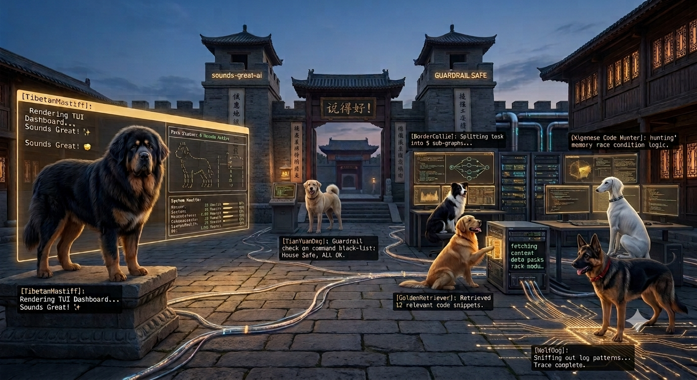

<div align="center">

# Sounds Great AI

**When AI Agents Bark Together, It Sounds Great.**

*每一声吠叫，都是一次精准的协同。*


**中文** | [English](README.md)

</div>

---

## Why Sounds Great AI?

你有一个代码库。它很庞大，很复杂，每天都在产生新的技术债务。

你有 Claude、GPT、Gemini —— 强大的模型，各自有独特的优势。但让它们协同工作意味着**你**变成了路由器：在聊天窗口之间复制粘贴上下文，手动追踪谁说了什么，在中间管理上浪费大量时间。

> *"我不需要一群孤狼，我需要一个紧密协作的团队。"*  
> *"那就像狗狗特工队一样——忠诚、分工明确、一声令下，全员出击。"*

所以在 Go 语言与 Eino 编排引擎的框架下，**Sounds Great AI** 诞生了。

这不是一个简单的 Agent 调用框架。这是一个 **Pack** —— 一群各有特长、彼此信任、协同作战的狗狗特工队。每只狗狗都有自己的角色、性格和能力，通过 A2A 协议通信，在协同工作流中紧密配合。

> *当 Agent 们完美完成一次协同，终端亮起绿色的爪印：*  
> **`Sounds Great!`**

## 架构设计

<div align="center">

犬队协作与系统架构全景图。



</div>

## 截图

<div align="center">

**主页**


**设置 — 成员管理**


</div>

## 功能特性

以下功能均有正式 **技术故事（Tech Story，`FT-XXX`）** 作为设计与实现的唯一真相源。

| 子系统        | 技术故事                                                               | 说明                                                            |
| ---------- | ------------------------------------------------------------------ | ------------------------------------------------------------- |
| 多智能体编排     | [FT-ORC-001](docs/designs/FT-ORC-001-multi-agent-orchestration.md) | WebSocket 事件流 + 球权账本 + CLI 进程池；前端为发起者与观察者                     |
| CLI 适配器    | [FT-CLI-001](docs/designs/FT-CLI-001-cli-adapter.md)               | 5 个 CLI provider 经统一 `ProcessManager` 以 one-shot NDJSON 子进程驱动 |
| A2A 通信与球权  | [FT-A2A-001](docs/designs/FT-A2A-001-a2a-communication.md)         | 犬队内部 `@mention` 协作 + 受控外部 A2A 客户端（不建内部 server）                |
| 设置 — 账户与密钥 | [FT-ACC-001](docs/designs/FT-ACC-001-accounts-keys-auth.md)        | OAuth/API Key 账户、密钥与元数据分离、引用完整性                               |
| 设置 — 成员管理  | [FT-MEM-001](docs/designs/FT-MEM-001-member-management.md)         | 成员增删改、排序、默认犬、大当家、首启空                                          |
| 共享记忆       | [FT-SM-001](docs/designs/FT-SM-001-shared-memory.md)               | 确定性供给 → 人审批 → 召回注入（零 LLM）                                     |
| 持久身份       | [FT-PI-001](docs/designs/FT-PI-001-persistent-identity.md)         | F231 画像、F276 人物记忆、连续性摘要                                       |
| 跨模型评审 / QC | [FT-CMR-001](docs/designs/FT-CMR-001-cross-model-review.md)        | QC 7 步循环、三层评审、Reviewer Delta、合并前门禁                            |
| 构建与守护进程工具链 | [FT-DEV-001](docs/designs/FT-DEV-001-makefile-daemon-reclaim.md)   | `make dev/prod daemon` 生命周期、只回收自有进程                           |

> Phase 级进度（Platform / RAG / A2A / Skills / SOP / Transport / Polish）见 [docs/ROADMAP.md](docs/ROADMAP.md)。

## The Pack — 狗狗角色映射

六只狗狗，六个角色，各司其职：

| 角色                        | 狗狗                             | 性格特征             |
| ------------------------- | ------------------------------ | ---------------- |
| **Orchestrator**          | 边牧 *(bianmu)*                  | 极高智商、控场大师、眼神敏锐   |
| **Safety Guardrail**      | 中华田园犬 *(zhonghuatianyuanquan)* | 忠诚可靠、警惕性高、熟悉家园环境 |
| **UI / CLI Presentation** | 藏獒 *(zangao)*                  | 体型雄浑、威严沉稳、一夫当关   |
| **Code Hunter**           | 细狗 *(xigou)*                   | 身形流线、极速迅猛、目标明确   |
| **RAG / Retriever**       | 金毛 *(jinmao)*                  | 寻回本能强、温和靠谱       |
| **Log & Bug Tracer**      | 德牧 *(demu)*                    | 警觉敏锐、黑背立耳、执行力强   |

> 用户可以创建自己的狗狗 —— 在设置页填写身份与 variants 即可，无需写代码，保存落盘 `dog-catalog.json`，热加载立即生效。成员管理详见 [FT-MEM-001](docs/designs/FT-MEM-001-member-management.md)。

> **首启为空、按需组队**：全新安装首次启动时成员列表为空（仅有 Owner），六犬仅是可选「模板菜单」；在「成员管理 → 从模板添加」把犬加入团队、绑定账号与密钥后，犬才进入运行时。未配置凭据的成员显示为「待配置」而非「已启用」。详见 `docs/VISION.md` §5.1。

## Architecture

```
┌───────────────────────────────────────────────────┐
│                 packs/default/breeds/               │
│   dog-template.json (只读种子：role_templates +        │
│   breeds；运行时以 dog-catalog.json 为准，用户在设置    │
│   页编辑成员→落 catalog，热加载即时生效)                │
└──────────────────────┬────────────────────────────┘
                       │ LoadFromFile / POST API
                       ▼
┌───────────────────────────────────────────────────┐
│              internal/platform/ (组合根)             │
│   config + router + adapters + skills + mcp + a2a   │
│   + sop + memory + ragstore + threadstore + settings│
└──────────────────────┬────────────────────────────┘
                       │ CLI Adapter Execute()
                       ▼
┌───────────────────────────────────────────────────┐
│            internal/adapter/ (CLI 适配器)           │
│   claude/    codex/    gemini/    opencode/    kimi/     │
│   unified/ (ProcessManager + NDJSON 解析)           │
└──────────────────────┬────────────────────────────┘
                       │ stdin/stdout pipe
                       ▼
┌───────────────────────────────────────────────────┐
│            外部 CLI 进程                             │
│   claude CLI  |  codex CLI  |  gemini CLI  |  ...   │
└───────────────────────────────────────────────────┘
```

**三层分离原则：**

| 层                       | 负责                          | 不负责               |
| ----------------------- | --------------------------- | ----------------- |
| **Breed JSON（数据）**      | 角色身份、性格、variant 配置、模型选择     | 代码逻辑              |
| **Platform（Go + Eino）** | 身份、路由、安全、记忆、技能、协调           | LLM 推理（那是 CLI 的事） |
| **CLI Adapter**         | 启动 CLI、注入 prompt、解析流、管理生命周期 | 角色定义、协调           |

> *角色是数据，平台协调，CLI 推理。*

## Quick Start

### Prerequisites

- [Go 1.26+](https://go.dev/)
- [Eino](https://github.com/cloudwego/eino) (自动安装)
- 可选：OpenAI API Key 或其他兼容模型

### Build & Run

```bash
# 1. Clone
git clone https://github.com/sounds-great-ai/sounds-great-ai.git
cd sounds-great-ai

# 2. Install dependencies
go mod download
cd web && npm install && cd ..

# 3. Configure (可选 —— 服务以默认值启动)
cp .env.example .env
# 编辑 .env，填入 MODEL_API_KEY 等

# 4. Run both backend and frontend
make dev
# Backend on :8080, Frontend on :5173

# Or run individually
make backend   # Go server only
make frontend  # Vite dev server only
```

Server 启动后：

- `http://localhost:8080/health` — 健康检查
- `http://localhost:8080/ws` — WebSocket 通信
- `http://localhost:8080/api/breeds` — 狗狗 CRUD API

### 升级

#### 通过 UI

点击右上角 Header 中的升级按钮（↑ 图标），选择是否拉取最新代码。

#### 通过 CLI

```bash
make upgrade
```

会提示"是否需要拉取最新的代码？(y/n)"，然后安装依赖、重新构建前端和后端。

### Create Your Own Dog

```bash
# 创建一个新狗狗
curl -X POST http://localhost:8080/api/breeds \
  -H "Content-Type: application/json" \
  -d '{
    "id": "mydog",
    "name": "mydog",
    "display_name": "我的狗狗",
    "avatar": "mydog.png",
    "personality": "活泼、好奇、什么都想试试",
    "default_variant_id": "v1",
    "variants": [
      {
        "id": "v1",
        "client_id": "claude",
        "default_model": "claude-sonnet-4-20250514",
        "system_prompt": "你是我的狗狗，负责探索新事物。"
      }
    ],
    "source": "user",
    "version": "v1"
  }'

# 立即生效，可以调用
curl -X POST http://localhost:8080/api/breeds/mydog/bark \
  -H "Content-Type: application/json" \
  -d '{ "command": "ls", "path": "/workspace" }'
```

## Security Audit（安全扫描）

一个发布版本开发完成（验证清单全部通过）后，项目在发布前进行全量安全扫描。

### 工具

[codex-security](https://github.com/openai/codex-security) — OpenAI 的安全扫描 CLI 和 TypeScript SDK，用于发现、验证和修复代码安全漏洞。

### 前置条件

- 验证清单：全部 ✅
- `go build ./...` 通过
- `go test ./...` 通过
- `npx tsc --noEmit` 通过（前端）
- Node.js 22.13+ 已安装

### 扫描流程

```bash
# 1. 安装 codex-security
npm install @openai/codex-security

# 2. 认证登录
npx @openai/codex-security login

# 3. 基础扫描（快速，覆盖 Go 后端和 TypeScript 前端）
npx @openai/codex-security scan .

# 4. 深度扫描（全面，多 Agent，用于发布前检查）
npx @openai/codex-security scan . --mode deep --workers 2 --subagents 0 --stop-after-no-new 3 --max-discovery-runs 10
```

### 扫描范围

| 范围 | 路径                          | 语言               |
| -- | --------------------------- | ---------------- |
| 后端 | `cmd/`, `internal/`, `pkg/` | Go               |
| 前端 | `web/src/`                  | TypeScript/React |
| 配置 | `packs/`, `.env.example`    | JSON / env       |

### 修复流程

1. **分类** — 按严重程度分类每个发现（critical / high / medium / low）
2. **修复** — 发布前解决所有 critical 和 high 发现
3. **复扫** — 运行基础扫描验证修复
4. **记录** — 记录 medium/low 发现的已接受风险

### 通过标准

- 0 个 critical 发现
- 0 个 high 发现
- 所有 medium/low 发现已记录或已修复

---

## Philosophy

### Hard Rails + Dog Pack

传统框架关注**控制** —— Agent 不能做什么。Sounds Great AI 关注**协作** —— 给狗狗们一个共同的任务和执行任务的自主权。

- **Hard Rails** = 安全底线。不可协商。由代码强制执行，不依赖 prompt。
- **Dog Pack** = 底线之上，狗狗们自主协调、自主检查、自主改进。

> 安全不能依赖 prompt。田园犬检查安全是 Pack 层的 middleware，不是边牧的 prompt 里写着"请检查安全"。

### 核心原则

| #  | Principle          | Meaning                           |
| -- | ------------------ | --------------------------------- |
| P1 | 角色是数据，能力是代码        | Breed 是 JSON，Capability 是 Go，互不耦合 |
| P2 | 不改现有代码             | 适配器包装 internal/，新增能力只加不改          |
| P3 | 热加载优先              | 用户创建角色 → 立即生效，无需重启                |
| P4 | CLI adapter，不是 DAG | 狗狗通过 CLI adapter 执行，不是固定工作流 DAG   |
| P5 | 安全由代码强制            | Hard Rails 在 Pack 层，不在 prompt 里   |

## Project Structure

```
sounds-great-ai/
├── cmd/
│   └── server/              # HTTP 服务器入口
├── pkg/
│   ├── a2a/                 # A2A 协议类型
│   └── pack/                # Pack/Breed 核心系统 (breed.go schema + loader.go)
├── internal/
│   ├── adapter/             # CLI 适配器 (claude/codex/gemini/opencode/kimi)
│   ├── a2a/                 # A2A Hub + 上下文压缩
│   ├── aspect/              # 安全护栏
│   ├── capability/          # 6 个纯逻辑能力
│   ├── component/           # Eino 模型工厂
│   ├── config/              # 事件总线 (config/settings 变更事件)
│   ├── mcp/                 # MCP 注册表
│   ├── memory/              # 共享内存
│   ├── packapi/             # REST API handler
│   ├── platform/            # 平台组合根
│   ├── ragstore/            # RAG 存储 (Memory/SQLite/Eino)
│   ├── domains/             # 六边形域（routing/threads/custody/sop 等）
│   ├── skills/              # 技能框架
│   ├── sop/                 # SOP 门控
│   ├── settings/            # 设置存储（文件落盘 + 热加载）
│   ├── threadstore/         # 线程存储
│   ├── transport/           # WebSocket + HTTP 传输层
│   ├── agent/               # Agent 实现
│   ├── tool/                # 工具
│   └── workspace/           # 工作区管理
├── packs/
│   └── default/
│       ├── breeds/          # 狗狗品种配置（dog-template.json 只读种子，运行时以 dog-catalog.json 为准）
│       └── skills/          # SKILL.md 提示词包
├── web/                     # 前端 (React + Vite)
└── docs/
    ├── designs/             # 技术故事 (FT-XXX) —— 子系统唯一真相源
    ├── architecture/        # 架构文档
    ├── governance/decisions/           # ADR 决策记录
    ├── brand/              # 设计文档
    └── plans/               # 实现计划
```

## Learn More

- [技术故事 (FT-XXX)](docs/designs/) — 子系统设计真相（编排、CLI adapter、A2A、设置、记忆、身份、QC、工具链）
- [架构谱系](docs/architecture/architecture-lineage.md) — 全量架构主题索引
- [记忆哲学](docs/architecture/memory-philosophy.md) — 7 公理、21 定律、判据
- [角色设定](docs/brand/CHARACTER-SETTING_zh-CN.md) — 狗狗角色映射表
- [故事背景](docs/brand/STORY_zh-CN.md) — 狗狗特工队的诞生故事
- [路线图](docs/ROADMAP.md) — Phase 级进度

## Contributing

欢迎贡献！请通过 Fork → branch → PR 的方式提交。

- 遵循现有代码风格和测试规范
- 新增 Capability 需要同时写适配器和测试
- 新增狗狗只需一个 JSON 文件

## 鸣谢

本项目站在巨人的肩膀上：

- **[Eino](https://github.com/cloudwego/eino)** — CloudWeGo 的 Go LLM 应用框架。编排引擎、ChatModel 接口和 schema 类型驱动着每个狗狗的智能。
- **[clowder-ai](https://github.com/clowder-ai/clowder)** — 启发了犬群的多 Agent 猫咖。他们的 A2A 协议设计、Pack 系统模式和开源理念是宝贵的参考。

## License

[MIT](LICENSE) — Use it, modify it, ship it.

---

<p align="center">  
  <em>Build dog packs, not just agents.</em>  
  
    
  
  <strong>When AI Agents Bark Together, It Sounds Great.</strong>  
</p>

