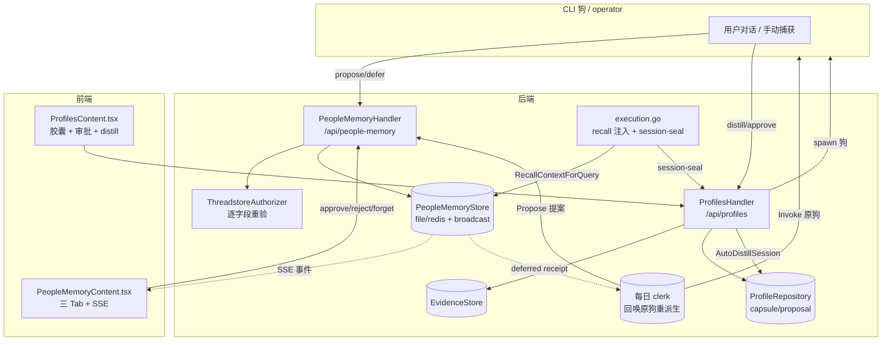

# [SG-PI-001] [Tech Story] Persistent Identity 前后端逻辑梳理（F231 关系胶囊 + F276 人物关系记忆 + Continuity）

> 本文是 **代码级逻辑梳理 Story**，非新需求交付。目标：把 sounds-great-ai 的 Persistent Identity 能力（后端 + 前端）按数据流、状态机、前后端协作一次性讲清，作为后续维护 / 评审 / onboarding 的真相源。
> 数据来源：全部实读 `internal/settings/people_memory*.go`、`internal/transport/people_memory_handler.go`、`internal/transport/profiles_handler.go`、`internal/transport/execution.go`、`web/src/components/people-memory/`、`web/src/components/profiles/`、`web/src/services/peopleMemoryService.ts`、`web/src/services/profilesService.ts`，非印象。

---

## 1. 元信息与背景 (Context & Value)

- **类型**: [x] Tech Story（架构/逻辑梳理，既有系统）
- **责任人**: Dev: @bianmu（梳理） | Reviewer: 跨犬 review（xigou）
- **复杂度**: L（跨前后端 + 三个子系统 + 多 operator 隔离）
- **目标**:
  - As a **维护者 / 评审者**,
  - I want to **一张图看清 Persistent Identity 的全链路（捕获→审批→落盘→召回注入 / 蒸馏→审批 / 延迟回执→clerk 回唤）**,
  - So that **改动任何一处都能定位上下游、不破坏审批治理与 fail-closed 守卫**。

### 1.1 Persistent Identity 的三块拼图

| 子系统 | 代号 | 关注对象 | 后端入口 | 前端入口 | 存储 |
|--------|------|----------|----------|----------|------|
| 关系胶囊（养熟） | **F231** | 狗**自己**与 operator 的长期关系画像 | `ProfilesHandler`（`/api/profiles`） | `web/src/components/profiles/*` | `ProfileRepository` |
| 人物与关系记忆 | **F276** | **第三方人物**的事实/判断/关系/事件 | `PeopleMemoryHandler`（`/api/people-memory`） | `web/src/components/people-memory/PeopleMemoryContent.tsx` | `PeopleMemoryStore`（file/redis） |
| 连续性摘要 | **P3** | 每犬按 rotation 的 continuity digest | `ContinuityHandler`（`/api/continuity`，**仅 inspection，无前端**） | 无 | `ContinuityStore` |

> **铁律边界（贯穿全文）**：平台层（`internal/`）**不做推理**——任何「蒸馏 / 派生提案」都由 CLI 狗执行，平台只聚合证据、解析回复、截断预算、写 *pending proposal*，必须由 operator 显式批准才生效（VISION §4.1）。多 operator 通过 `operatorID` / `X-Operator-Id` 隔离；任何不可验证的 source 引用 **fail-closed 零写入**。

---

## 2. 系统全景与数据流

---

## 3. 后端逻辑

### 3.1 F276 人物与关系记忆（`internal/settings/people_memory*.go` + `internal/transport/people_memory_handler.go`）

**六类逻辑对象**（`people_memory.go` 的 `peopleMemoryDocument`）：`People`（身份根）/ `Claims`（版本化 claim）/ `Relationships`/`Events`/`Candidates`（审批信封）/ `Receipts`（延迟回执）/ `Decisions`（可撤销回执）。operator 隔离：`map[operatorID]*peopleMemoryDocument`，落盘 `ConfigRoot/people-memory.json`（file 后端）或 Redis keyspace（redis 后端）。

**候选状态机 + 逐 draft 审批**（`people_memory_doc.go`）：
- 状态：`pending_approval → materialized / rejected / partially_materialized / not_now / withdrawn`。
- `propose` 只落盘**信封**，不物化真理；最多 3 张 claim 草稿 + 可选 1 关系卡 + 1 互动卡。
- `approveDrafts`：**逐草稿**物化为 canonical truth**；`agent_inference` 草稿**拒绝物化**（AC-A3）；同 `claimKey` 的旧 current claim 自动 `superseded`（版本化，不覆盖）；关系卡 upsert（追加 transition）；全部决定后 `materialized`，否则 `partially_materialized`。
- `rejectDrafts`：逐草稿标 `rejected`，永不物化（fail-closed）。`undoDecision`：按 `DecisionReceipt` 反物化并恢复被 supersede 的 claim。

**双路径（defer receipt + clerk 回唤原狗重派生）**：
- `DeferReceipt` 写**无内容**回执（仅 server-derived owner/cat/源坐标/digest，绝不存正文）。
- 每日 04:30 clerk（`RunPeopleMemoryClerkOnce`）遍历 ready 回执 → `ReserveDeferredReceipt` → 经 `PeopleMemoryClerkDeps.Invoke` **回唤原狗**（`client_id = requesterCat`），喂入 `ResolveSource` 从 `MessageStore` 取的 exact source 正文 + 结构化提案提示（狗只输出单 JSON，不静默物化）→ 平台 `parseClerkProposal` 解析并 `Propose` 落盘为可驳回候选（`DeferredReceiptID` 回绑）。证据不足 / 狗返回 `{"defer":true}` → 释放回执次日重试；`Invoke` 为 nil → 降级旧行为（空壳卡）。**平台「狗推理 + 平台解析落盘」的 clerk 回唤方案（回执责任方分离）**。

**recall 注入（聊天卡，≤160/≤600 预算）**（`people_memory_recall.go` + `execution.go:157`）：用户消息含已知人物别名时，`RecallContextForQuery(pmOp, query)` 产出「## 关系记忆」块（anchor-first，F236 预算上限），单卡 ≤160 token、全段 ≤600 token（超限逐条 pop facts / 丢 interaction / 丢 relationship line），注入狗 system prompt。`estimateTokens` 用 CJK ≈ 4 runes/token。

**drill 钻取预算（≤500/call、3 人/turn、1200 aggregate/turn）**（`people_memory_recall.go` + `people_memory_drill_test.go`）：`RecallDrill(operatorID, input)` 按 `kind`（claim/relationship/event）在文档中查 `id` + `status` 重验 + 取 `SourceRefs[0]`；per-turn 预算 key = `operatorID\x00turnID`；`callsByPerson ≥ 3` 或 `aggregate+bounded > 1200` → `budget_exceeded`；`boundedProjectionText` 按 0.8x 截断到 500 token。file + redis 双后端（read-only，只动 ephemeral 预算 map）。HTTP：`POST /api/people-memory/recall/drill`。

**生命周期（fail-closed）**（`people_memory_lifecycle.go`）：`CorrectClaim`（expected-current 乐观锁 + supersede）、`RetireClaim`、`AmendInteraction`（append-only）、`RedactItem`（payload + source refs 清除，status=redacted）、`HardForget`（identity/claims/rels/events 全清 + 计数报告）、`HardForgetProposal`（person-bound 时 fail-closed，须整人 forget）。

**多用户级 source 鉴权重验**（`internal/transport/people_memory_auth.go`，2026-08-16 闭环）：`ThreadstoreAuthorizer.AuthorizeSource` 在 `Propose`/`Defer` 时 fail-closed 调用。`verifyMessageSource` 逐字段重验：① thread 存在 + 未删；② message 属 thread；③ **excerpt 经 `normalizeText` 必须包含于 `Message.Content`**（否则 `source_excerpt_mismatch`）；④ 若 `Ref` 非空须等于 `messageDigest(msg)`（sha256(id\0content\0timestamp)，否则 `source_digest_mismatch`）。**SG schema 缺口（文档化）**：owner 绑定 / 消息级 tombstone 因 `Message` 无 per-message 删除与 owner 字段、threadstore 未 operator-scoped 暂不可强制，留 `TODO(sg-f276)`。

**存储与实时**（`people_memory_store.go` / `people_memory_redis.go` / `people_memory_broadcast.go` / `people_memory_events.go`）：`FilePeopleMemoryStore`（零依赖，原子写 `people-memory.json`）与 `RedisPeopleMemoryStore`（可选，运行时按 `SG_REDIS_URL` 激活）均实现 `PeopleMemoryStore`；`BroadcastingPeopleMemoryStore` 装饰器嵌入接口、只读方法自动委托，写操作后向 `PeopleMemoryEventHub` 广播 SSE 事件（前端实时刷新）。

### 3.2 F231 关系胶囊 / 养熟（`internal/transport/profiles_handler.go` + `settings.ProfileRepository`）

**capsule / proposal 状态机**：`ProfileRepository` 存 active capsule（`RelationshipCapsule`：key/body/ownerCat/sourceRef/eval 计数）+ 一个 pending `proposal`。`PUT /api/profiles/{key}` 直接写（当前前端未调用）；正常路径是**提案→审批**。

**Distill（平台只聚合，不推理）**（`Distill`，:287）：`evidence.ListEvidence()` 按 key 过滤，返回证据列表 + `evidence_count` + 提示 operator 走 `propose`/`PUT`。**不调用 LLM**。

**DistillAgent（spawn 狗，平台只解析+截断）**（`DistillAgent`，:340）：① 派生蒸馏者——`?session_id`（当前会话的狗，即狗蒸馏自己的 primer）或 `?client_id`（operator 覆盖）；**无硬编码默认狗**，二者皆无则 400；② 聚合证据 + 当前 capsule body 拼 prompt；③ `platform` 解析 breed→CLI client（`DefaultVariant().ClientID`）+ 注入 L0 身份（`PromptBuilder.Build`）让狗「以狗的口吻」蒸馏；④ `executor.Execute` 取流文本 → `extractFencedBlock(raw,"capsule")` → `TruncateCapsuleBody`（≤300 可见 rune，KD-7）→ 写 **pending proposal**（operator 须 approve）。env/executor/evidence 任一缺 → 503/400，**绝不静默默认狗**。

**AutoDistillSession（session-seal 自动触发，2026-08-16 闭环）**（`:494`）：由 `execution.go` 的 `fireProfileDistillationTrigger` fire-and-forget 调用（`maybeAutoDistill`）。env `SG_AUTO_DISTILL_ON_SEAL=false/0` 可关；`relationshipKeyForBreed(breedID)` 取 breed 的 `RelationshipKey`；`HasProposal` 跳过防堆积；有匹配证据则聚合写 pending proposal（标「自动蒸馏草稿」），递增 `ProfileUpdateProposed`；全失败 swallow。

**eval 计数**：`ProfileUpdateProposed/Approved/Rejected`（OTel `dog_pack.*`）。F276 侧另有独立 `PeopleMemoryProposed/Approved/Rejected/DrillInvoked`（不复用，避免源混淆）。

### 3.3 Continuity（P3，仅后端 inspection）

`ContinuityHandler`（`/api/continuity`、`/api/continuity/{breedID}`）暴露每犬按 rotation 的 checkpoint ring（one-shot 单 rotation-0；长 warm session 填充 ring）。**无前端 UI**，属运维/调试面。

---

## 4. 前端逻辑

### 4.1 F276 UI（`web/src/components/people-memory/PeopleMemoryContent.tsx` + `web/src/services/peopleMemoryService.ts`）

- **三 Tab + operator 切换**：人物 / 待批候选 / 延迟回执；顶部 operator 切换器，`getActiveOperator()/setActiveOperator()` 持久化 localStorage，`operatorHeaders()` 以 `X-Operator-Id` 发送。
- **实时同步（SSE）**：`PeopleMemoryContent.tsx:159` `new EventSource('/api/people-memory/events?operator='+appliedOperator)`；`onopen→liveState='open'`、`onmessage→reloadRef.current()`（重刷当前 tab/详情）、`onerror→'error'`（自动重连）；切换 operator 重开订阅。**这是 SG 在 F276 单会话聊天卡之上新增的实时同步（SSE）增强**。
- **核心交互**：
  - 新建捕获：多草稿表单（N 张 claim 卡 + ≤1 关系卡 + ≤1 互动卡，`submitCapture` :242）。
  - 候选详情：`CandidateDetailView` + `DraftCard`，**每张草稿独立批准/驳回**（:994）；支持全部批准/驳回、稍后(not-now)、撤回、撤销审批（:1028）。决定后 `DraftCard` 就地折叠为 ✅/🚫。
  - 人物详情：`PersonDetailView` 显示 Recall Card（标注「≤160 tokens」:780）、claims（纠正/退役/脱敏，状态色 current/superseded/retired :832）、relationships、events（修正/脱敏）、hard-forget（`confirm()` 二次确认 :750）。
  - 延迟回执：`DeferredListView` 转候选/撤回/遗忘。
- **状态**：纯局部 `useState/useRef/useCallback`，无 context/外部 store。
- **API 客户端**：`web/src/services/http.ts` 的 `apiGet/apiPost/...`（原生 fetch + `Authorization: Bearer`）；无 react-query。

### 4.2 F231 UI（`web/src/components/profiles/*` + `web/src/services/profilesService.ts`）

- **结构**：左侧关系键列表（选中即加载）；右侧 `RelationshipCapsuleCard`（active 画像 body + 主人 breed 圆点 + 赞/踩计数）；有 proposal → `ApprovalCard`（批准并写入 primer / 驳回）；无 proposal → `DistillControls`。
- **DistillControls 三种触发**（`DistillControls.tsx:27`）：①「让当前会话的狗蒸馏」（`activeThreadId`，来自 zustand `useAppStore`）；②「指定狗狗蒸馏」（`client_id` 覆盖，来自 `breedMeta.ts` 的 `BREED_OPTIONS`）；③「仅聚合证据」（不 spawn 狗）。
- **ApprovalCard 状态机**：pending/busy/approved/rejected/error（:13）；终态就地折叠为「✓ 已批准并写入 primer」「已驳回该提议」（:48）。
- **实时**：**无 SSE**，每次决策后 `handleChanged()`（ProfilesContent.tsx:55）重调 `loadDetail`+`loadList` 手动刷新。**无 token/蒸馏预算显示**。
- **状态**：`ProfilesContent` 纯局部 `useState`；`DistillControls` 额外用 zustand `useAppStore`。**无 operator 头**（蒸馏者靠 session_id/client_id 服务端派生）。

---

## 5. 前后端协作：四条端到端数据流

### 流 A — 捕获→审批→物化→召回
`FE 提交 propose` → `PM.Propose`（SSE 广播）→ `FE 候选列表实时刷新` → `FE 逐 draft approve` → `PM.ApproveDrafts`（物化 canonical，SSE 广播）→ 下次对话 `execution.RecallContextForQuery` 注入关系卡进狗上下文。

### 流 B — 延迟回执→clerk 回唤→提案
`FE 提交 defer`（仅源坐标）→ `PM.DeferReceipt` → 04:30 clerk 取 ready 回执 → `ClerkDeps.Invoke(requesterCat)` 回唤原狗（exact source 正文 + 提案提示）→ 狗输出 JSON → 平台 `parseClerkProposal` → `PM.Propose`（pending，回绑 receiptID）→ `FE 候选列表出现`，operator 审批。

### 流 C — 蒸馏→审批（养熟）
对话中/session-seal → `PS.DistillAgent`（spawn 狗）或 `execution.fireProfileDistillationTrigger→PS.AutoDistillSession`（自动）→ 写 **pending proposal** → `FE ProfilesContent` 出现待审（侧栏圆点）→ `ApprovalCard` 批准 → `PS.Approve` 写入 active capsule（狗下次以更新后画像协作）。

### 流 D — 实时同步
`BE 任何写操作 → PeopleMemoryEventHub 广播` → `FE SSE onmessage → reloadRef 重刷`；F231 走手动 reload（无 SSE）。

---

## 6. 技术契约：API 路由清单

### 6.1 F276（`/api/people-memory`，operator 隔离 + SSE）
| 方法 + 路径 | 处理 | 说明 |
|------|------|------|
| GET `/api/people-memory` | ListPeople | 人物列表 |
| GET `/api/people-memory/operators` | ListOperators | operator 枚举（clerk 迭代用） |
| GET `/api/people-memory/events` | StreamEvents | **SSE** 实时事件（`?operator=`） |
| GET `/api/people-memory/candidates` | ListCandidates | 待批候选 |
| GET `/api/people-memory/deferred` | ListDeferred | 延迟回执 |
| GET `/api/people-memory/person/{personID}` | GetPerson | 人物详情 |
| GET `/api/people-memory/person/{personID}/card` | RecallCard | 关系卡 |
| POST `/api/people-memory/propose` | Propose | 提交候选（fail-closed 鉴权） |
| POST `/api/people-memory/defer` | Defer | 无内容延迟回执 |
| GET `/api/people-memory/candidates/{id}` | GetCandidate | 候选详情 |
| POST `/api/people-memory/candidates/{id}/approve` | Approve | 逐 draft 批准物化 |
| POST `/api/people-memory/candidates/{id}/reject-drafts` | RejectDrafts | 逐 draft 驳回 |
| POST `/api/people-memory/candidates/{id}/reject` | Reject | 拒整个候选 |
| POST `/api/people-memory/candidates/{id}/not-now` | NotNow | 稍后 |
| POST `/api/people-memory/candidates/{id}/withdraw` | Withdraw | 撤回（未物化） |
| POST `/api/people-memory/candidates/{id}/undo` | Undo | 撤销审批 |
| POST `/api/people-memory/candidates/{id}/forget` | ForgetProposal | 遗忘提案（person-bound fail-closed） |
| POST `/api/people-memory/person/{personID}/claims/{claimID}/correct` | CorrectClaim | 纠正（乐观锁 supersede） |
| POST `/api/people-memory/person/{personID}/claims/{claimID}/retire` | RetireClaim | 退役 |
| POST `/api/people-memory/person/{personID}/events/{eventID}/amend` | AmendEvent | 修正（append-only） |
| POST `/api/people-memory/person/{personID}/items/redact` | RedactItem | 脱敏 |
| POST `/api/people-memory/person/{personID}/forget` | ForgetPerson | hard-forget |
| POST `/api/people-memory/recall/drill` | Drill | on-demand 钻取（预算纪律） |
| POST `/api/people-memory/deferred/{receiptID}/claim` | ClaimDeferred | 回执转候选 |
| POST `/api/people-memory/deferred/{receiptID}/withdraw` | WithdrawReceipt | 撤回回执 |
| POST `/api/people-memory/deferred/{receiptID}/forget` | ForgetReceipt | 遗忘回执 |

### 6.2 F231（`/api/profiles`）
| 方法 + 路径 | 处理 | 说明 |
|------|------|------|
| GET `/api/profiles` | List | 关系键 + 状态 + eval 计数 + 待审标记 |
| GET `/api/profiles/{key}` | Get | 胶囊详情 |
| PUT `/api/profiles/{key}` | Upsert | 直接写（前端未用） |
| DELETE `/api/profiles/{key}` | Delete | 删除 |
| POST `/api/profiles/{key}/propose` | Propose | 提交胶囊提案 |
| GET `/api/profiles/{key}/proposal` | GetProposal | 取待审（404→null） |
| POST `/api/profiles/{key}/proposal/approve` | Approve | 批准写入 active |
| POST `/api/profiles/{key}/proposal/reject` | Reject | 驳回 |
| POST `/api/profiles/{key}/distill` | Distill | 仅聚合证据（不推理） |
| POST `/api/profiles/{key}/distill/agent` | DistillAgent | spawn 狗蒸馏（session_id/client_id） |

### 6.3 P3（`/api/continuity`，仅 inspection）
`GET /api/continuity`、`GET /api/continuity/{breedID}`。

---

## 7. 验收标准 / 工程护栏（映射现有测试与铁律）

- [x] **AC-01 正常路径**：propose→approve 物化 canonical；defer→clerk 回唤→提案→approve；distill→proposal→approve。均有单测覆盖（`people_memory_test.go`、`people_memory_clerk_reinvoke_test.go`、`profiles_handler_test.go`）。
- [x] **AC-02 异常/边界**：未知 thread/message→403 fail-closed；伪造 excerpt/digest→403（`TestPeopleMemorySourceFieldReverify`）；drill 超预算→`budget_exceeded`（`TestRecallDrillBudgetDiscipline`）；自动蒸馏重复 seal 不堆积（`TestAutoDistillSession`）。
- [x] **AC-03 权限/安全**：operator 隔离（`operatorID` 首参）；source 引用 fail-closed 零写入；hard-forget person-bound fail-closed；agent_inference 永不物化。
- [x] **平台不推理**：Distill 不调 LLM；DistillAgent/AutoDistillSession 仅聚合+解析+截断，狗执行推理。
- [x] **可服务性**：独立 OTel 计数 `PeopleMemory*` / `ProfileUpdate*`（warmup 预触）；SSE 实时同步（F276）。
- [ ] **降级**：Redis 可选（无 `SG_REDIS_URL` 时 file 后端，零新增依赖）；executor/evidence 为 nil 时 distill 端点 503 优雅降级。

---

## 8. 关键文件索引

**后端**
- `internal/settings/people_memory.go` — 类型与六类对象定义（F276 真相源）
- `internal/settings/people_memory_doc.go` — 文档级 mutation（propose/approve/reject/undo）
- `internal/settings/people_memory_store.go` — `PeopleMemoryStore` 接口 + `FilePeopleMemoryStore`
- `internal/settings/people_memory_recall.go` — recall 注入 + drill 预算
- `internal/settings/people_memory_lifecycle.go` — correct/retire/amend/redact/hardForget
- `internal/settings/people_memory_clerk*.go` — 双路径 clerk（回唤原狗）
- `internal/settings/people_memory_redis*.go` — Redis 后端 + 装饰器
- `internal/settings/people_memory_events.go` / `people_memory_broadcast.go` — SSE hub + 广播
- `internal/settings/people_memory_auth.go` — ThreadstoreAuthorizer 逐字段重验
- `internal/transport/people_memory_handler.go` — F276 HTTP handler + 路由
- `internal/transport/people_memory_auth.go` — 跨线程 source 鉴权重验（fail-closed）
- `internal/transport/profiles_handler.go` — F231 handler（Distill/DistillAgent/AutoDistillSession/Approve）
- `internal/transport/execution.go` — recall 注入（:157）+ session-seal 自动蒸馏触发
- `internal/telemetry/instruments.go` / `init.go` — `PeopleMemory*` / `ProfileUpdate*` 计数

**前端**
- `web/src/components/people-memory/PeopleMemoryContent.tsx` — F276 主 UI（1225 行，三 Tab + SSE）
- `web/src/services/peopleMemoryService.ts` — F276 API 客户端（X-Operator-Id）
- `web/src/components/profiles/ProfilesContent.tsx` — F231 主 UI
- `web/src/components/profiles/ApprovalCard.tsx` — 提案审批卡
- `web/src/components/profiles/DistillControls.tsx` — 蒸馏三种触发（zustand activeThreadId）
- `web/src/components/profiles/RelationshipCapsuleCard.tsx` — 胶囊展示卡
- `web/src/components/profiles/breedMeta.ts` — BREED_OPTIONS / 品种色
- `web/src/services/profilesService.ts` — F231 API 客户端
- `web/src/services/http.ts` — 共享 fetch 客户端（Bearer + ApiError）

---

*附：本文梳理的四项成熟度差距（自动蒸馏 trigger / eval 计数 / drill 预算 / source 鉴权重验）已于 2026-08-16 全部「已完成」并通过 `go build`/`vet`/`test` 闸门。*
