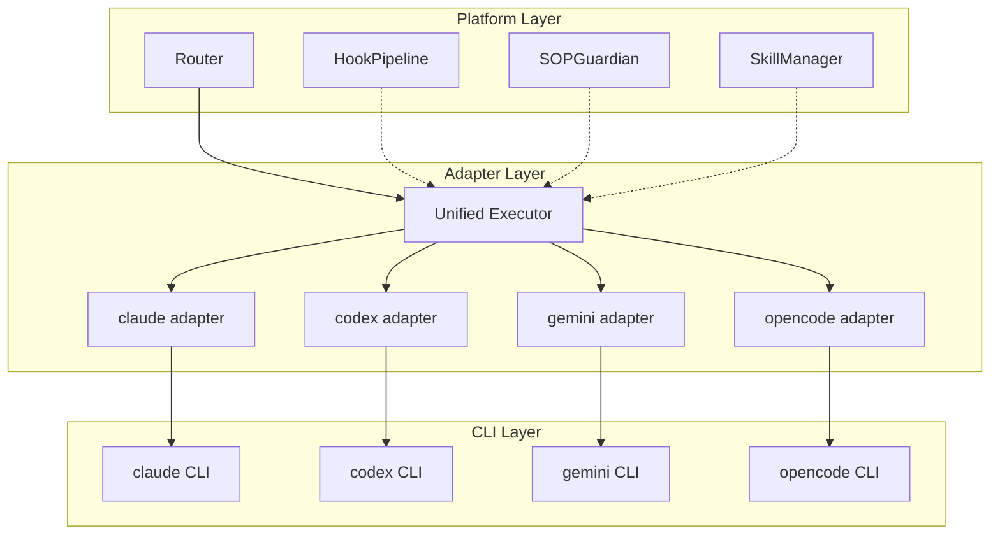
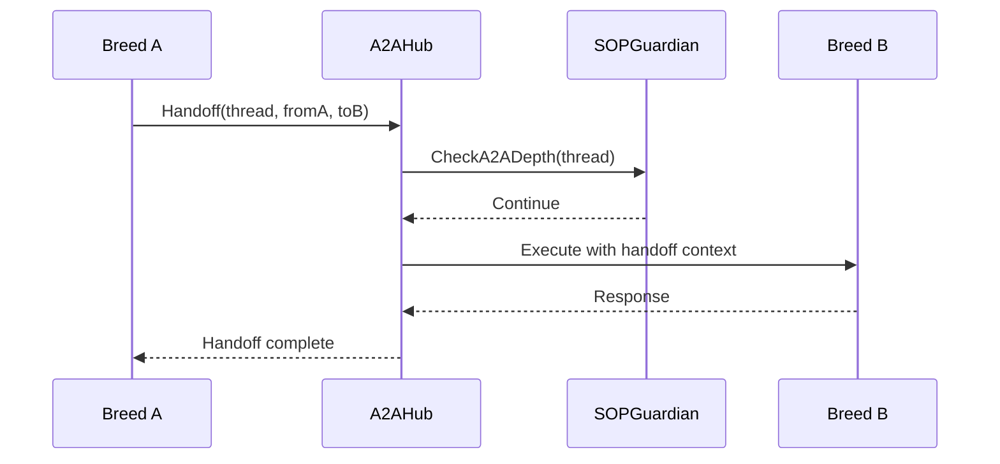

# Architecture Overview

## Three-Layer Principle



## A2A Handoff Flow



## Data Flow

```mermaid
graph LR
    User[User Input] --> WS[WebSocket Handler]
    WS --> Router[Router]
    Router --> Adapter[CLI Adapter]
    Adapter --> CLI[CLI Process]
    CLI -->|stream-json| Adapter
    Adapter -->|stream| WS
    WS -->|stream| User
    CLI -->|@mention| Hub[A2AHub]
    Hub --> SOP[SOPGuardian]
    SOP --> NextBreed[Next Breed]
    NextBreed --> CLI2[CLI Process 2]
```
