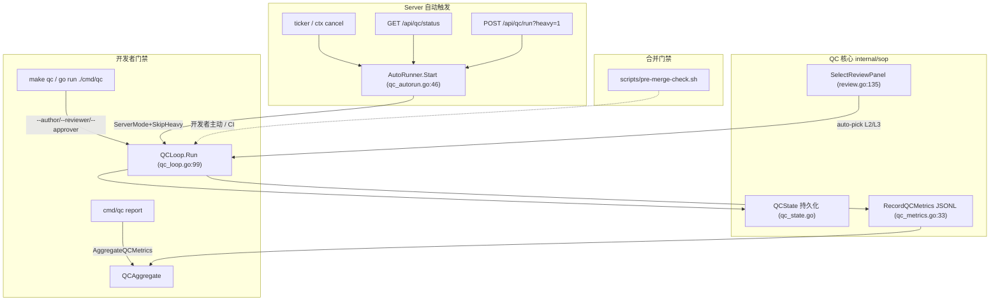

# [FT-CMR-001] [Tech Story] Cross-Model Review（跨模型评审 / QC 7步循环）代码级逻辑梳理

> 本文是 **代码级逻辑梳理 Story**，非新需求交付。目标：把 sounds-great-ai 的 Cross-Model Review 能力（`internal/sop` 的 QC 7步循环 + 三层角色评审 + 状态机 + Reviewer Delta 度量 + eval:qc 遥测 + pre-merge 门禁 + server 自动触发）一次性讲清，作为后续维护 / 评审 / onboarding 的真相源。
> 数据来源：全部实读 `internal/sop/review.go`、`qc_loop.go`、`qc_state.go`、`qc_metrics.go`、`qc_autorun.go`、`cmd/qc/main.go`、`cmd/server/routes.go`、`cmd/server/main.go`、`scripts/pre-merge-check.sh`，带 `文件:行号` 锚点，非印象。
> 代码实况基准：**2026-08-17**。对照 clowder（参考库 `readonly-docs/clowder-ai/`）的逐项差异见 `docs/plans/cross-model-review-wiring.md` §1。

---

## 1. 元信息与背景 (Context & Value)

- **类型**: [x] Tech Story（架构/逻辑梳理，既有系统）
- **责任人**: Dev: @bianmu（梳理） | Reviewer: 跨犬 review（xigou）
- **复杂度**: L（跨 CLI adapter + 状态机 + server 后台 + 脚本护栏 + 遥测聚合）
- **目标**:
  - As a **平台运行时（The Pack）与开发者**,
  - I want to **让「一只狗的产出由另一只狗（不同 breed / CLI 身份）独立评审」成为可执行、可度量、可自动巡检的流水线**,
  - So that **任何提交进入合并前都经过 hygiene → 跨犬评审 → 证据 → CI → 裁决 → 签核 的闭环，且评审价值（Reviewer Delta）被结构化记录，而不是黑盒或纯人工 trust-me**。

### 1.1 Cross-Model Review 的定义

「Cross-Model Review」= 一个模型/犬的产出，由**身份不同**的另一个模型/犬评审。SG 的身份粒度是 **`dog_id`**（variant 级，狗 + 绑定的 CLI adapter），而非 breed 标签（`review.go:158-173` 的 `ReviewCycle` 以 `AuthorDogID` / `AssignedReviewerDogID` 校验，因此跨 breed 但不是同一只真实狗也成立）。这与 clowder 的 `catId`（个体级猫）对齐。

### 1.2 特性拼图（子系统 → 代码落点）

| 子系统 | 关注点 | 核心代码 | 说明 |
|--------|--------|----------|------|
| 三层评审面板 | 选 reviewer / approver + fail-closed 写回 | `review.go:120-232` | L1 自动 hygiene / L2 具名 reviewer / L3 独立 approver |
| Reviewer Delta 度量 | 量化跨模型评审的增量价值 | `review.go:273-307` | 兼容 `[delta:*]` 与 clowder `[FC:*]` |
| QC 7步循环 | 编排 hygiene→…→sign_off | `qc_loop.go:59-312` | 风险分层 + 状态持久化 |
| QC 状态机 | stateless→stateful（stale/幂等） | `qc_state.go:20-105` | reviewedSha / idempotencyKey / staleFlag |
| eval:qc 遥测 | 逐次 JSONL + 聚合控制面 | `qc_metrics.go:18-90` | 喂 eval:qc 域 |
| pre-merge 门禁 | 合并前强制护栏 | `scripts/pre-merge-check.sh` | 4 项硬化护栏 |
| server 自动触发 | 后台周期巡检 + 端点 | `qc_autorun.go` + `routes.go:226-228` | 对齐 clowder F192 调度 |
| 开发者门禁入口 | `make qc` / report | `cmd/qc/main.go` | 显式跑 + 聚合报告 |

---

## 2. 系统全景与数据流



**关键事实**：`MergeGate`（`internal/sop/merge_gate.go`）当前**仅在测试里引用**，未接入运行中的 server —— SG server 本身没有真实 git merge 操作。因此「server 内自动触发」落地为**后台周期巡检 + 按需端点**（见 §7），而非阻塞式 merge 闸门；真正的强制门禁仍由开发者 `make qc` / CI 跑 `scripts/pre-merge-check.sh` 承担。

---

## 3. 三层角色拆分（细节展开）

SG 的三层设计对应 clowder F253 的 Maine Coon 三层（具名猫）模型，但 SG **更严格**。

| 层 | 角色 | 身份要求 | SG 代码 |
|----|------|----------|---------|
| **L1 · Hygiene** | 自动化格式/lint 修复 | 无需具名身份 | `qc_loop.go:step1Hygiene`（gofmt） |
| **L2 · Reviewer** | 具名狗，审逻辑/架构/安全/风格 | **必须 ≠ author** | `SelectReviewPanel` 选出的 `Reviewer`（`review.go:135-156`） |
| **L3 · Final Approver** | 具名狗，确认 final HEAD 覆盖全部 findings | **必须 ≠ author 且 ≠ reviewer** | `ReviewPanel.FinalApprover`（`review.go:135-156`） |

**为什么 SG 比 clowder 更严**：clowder F253 明文「L3 可 = L2 reviewer」（`readonly-docs/clowder-ai/docs/features/F253-qc-loop.md:139`）；SG 在 `SelectReviewPanel`（`review.go:140-154`）里**先把选中的 reviewer 从候选中剔除，再选 approver**，因此 `FinalApprover` 物理上不能等于 `Reviewer`。

**写回失败闭合（fail-closed）**：`ReviewCycle.RecordReview`（`review.go:214-232`）按 `dog_id` 校验三种拒绝：
- `ErrSelfReview`（`review.go:218-220`）：reviewer == author；
- `ErrWrongPrincipal`（`review.go:221-223`）：非指派的狗写 verdict；
- `ErrWrongCarrier`（`review.go:224-226`）：verdict 回写到了非指派线程。
比 clowder 的代码层更显式——clowder 在文档层声明，SG 在类型层强制。

**Reviewer Delta 协议兼容**：`ComputeReviewerDelta`（`review.go:290-307`）用正则 `\[(?i)(?:delta|fc):(covered|new|n/?a)\]`（`review.go:285`）同时解析 SG 自有 `[delta:*]` 与 clowder 的 `[FC:*]`。`Ratio = New / (New + Covered)`（`review.go:302-305`）。

---

## 4. QC 7步循环

`QCLoop.Run`（`qc_loop.go:99-154`）按 `assessRisk`（`qc_loop.go:83-97`）先做**风险分层**，再编排步骤：

| 步 | 名称 | 代码 | 行为 | 轻量层(docs-only) |
|----|------|------|------|-------------------|
| 1 | hygiene | `qc_loop.go:159-192` | `gofmt -l` 检测；`--fix` → `gofmt -w`；`--fix-commit` → `[qc-bot]` 提交（fix 前工作区已脏则拒绝吞 WIP） | ✅ 跑 |
| 2 | fresh_context | `qc_loop.go:194-206` | 跨犬无先验上下文评审；`ServerMode` 降级 advisory | ✅ 跑 |
| 3 | cross_breed_review | `qc_loop.go:208-229` | L2≠L3 独立性校验 | ⏭ 跳过 |
| 4 | evidence_manifest | `qc_loop.go:231-242` | 跟踪改动文件数 | ⏭ 跳过 |
| 5 | ci_repair | `qc_loop.go:244-273` | `go build ./...` + `go test ./...`；`SkipHeavy` 跳过 | ⏭ 跳过 |
| 6 | verdict | `qc_loop.go:275-289` | 真实聚合前 5 步，失败即 fail（非静默 pass） | ✅ 跑 |
| 7 | sign_off | `qc_loop.go:291-312` | `SOPGuardian.SignOff`；`ServerMode` 降级 advisory | ✅ 跑 |

**风险分层（`assessRisk`）**：
- 无文件清单 → `full`（保守默认）；
- 触碰任意 `.go` → `full`（共享能力，跑满 7 步）；
- 仅 `docs/*.md`/`README` → `light`（只跑 hygiene + fresh_context + sign_off，跳过 review/evidence/ci，`qc_loop.go:110-119`）。
对齐 clowder 按 `shared/` vs doc-polish 路由的 trigger strategy。

**状态机持久化（stateless→stateful 缺口已闭环）**：在真实 git 仓库内（`headSHA != ""`），`Run` 把 `reviewedSha` / `idempotencyKey` / `staleFlag` / `phase` 落盘到 `.qc-state.json`（`qc_loop.go:141-152`）；`phase` 取 `qc.archived`（通过）或 `qc.verdict_blocked`（不通过），对齐 clowder `qc.idle→…→qc.archived`。HEAD 变化由 `ComputeStale`（`qc_state.go:85-87`）判定 stale，重置 verdict。非 git 目录（测试 temp dir）无副作用、不落盘（`qc_loop.go:140-141`）。

---

## 5. eval:qc 遥测与聚合

`QCMetricsRecord`（`qc_metrics.go:18-28`）是每次运行的落盘结构（含 `author_breed` / `reviewer_breed` / `final_approver_breed` / `passed` / `steps` / `reviewer_delta`）。`RecordQCMetrics`（`qc_metrics.go:33-46`）以 **JSONL append-only** 写入 `<ConfigRoot>/qc-metrics.jsonl`，便于后续聚合。

`AggregateQCMetrics`（`qc_metrics.go:62-90`）折叠出 `QCAggregate`（`qc_metrics.go:52-58`）：`total_runs` / `passed_runs` / `pass_rate` / `avg_reviewer_delta` / `runs_by_author_breed`。

**消费端**：`cmd/qc report`（`cmd/qc/main.go:145-160`）打印聚合报告——这是 SG 补齐的 eval:qc「聚合控制面」。

**诚实 parity 说明**（修正此前两轮说法）：clowder 的 eval:qc pipeline **已接线**（F192 注册 + `qc-metrics-provider.ts` + 12 tests）但喂**零基线**（F253:374 明写 live 数据源未接）；SG 写的是**真实逐次 JSONL** 但此前无聚合，现已补聚合。结论：**两边都没有「活的聚合遥测」，属不同缺口的近似 parity**——既不是「SG 落后」也不是「完全对等」。

---

## 6. pre-merge 门禁（`scripts/pre-merge-check.sh`）

保留 SG 原有 5 步精神（分支/脏检查 → rebase → `go build` → `go vet`+`go test` → web → 报告），并硬化 4 项护栏（对齐 clowder，纯 bash 零新增依赖）：

- **A. Worktree 位置守卫**（`scripts/pre-merge-check.sh:58-68`）：禁止在主仓库内部 worktree 跑 gate（防 Node 向上解析兄弟目录 node_modules 造成 web build 假红）。
- **B. Gate 单飞锁**（`scripts/pre-merge-check.sh:77-100`）：`mkdir` 原子抢锁 + 持锁 pid 存活互斥 + 过期锁接管 + `trap` 释放。
- **C. dirty-worktree ledger**（`scripts/pre-merge-check.sh:173-184`）：merge 前列出全部 worktree 的未提交改动，确认有 PR/task 归属。
- **D. gate-last-run sentinel**（`scripts/pre-merge-check.sh:187-191`）：`date -u` 写入 `.sounds-great-ai/gate/last-run`，供 freshness 判定。

---

## 7. server 内自动触发（`qc_autorun.go` + `routes.go`）

对齐 clowder eval:qc 的「按时跑、出 verdict」调度形态（`qc_autorun.go:10-19`）。

- **装配**：`cmd/server/main.go` 创建 `sop.NewAutoRunner`，`BuildMuxWithHandler` 新增 `qcRunner *sop.AutoRunner` 参数（`routes.go:41`），并在 `qcRunner != nil` 时注册路由（`routes.go:226-228`）。
- **周期巡检**：`AutoRunner.Start`（`qc_autorun.go:46-71`）启动后 ~5s 先跑一次填充状态，随后按 `interval` ticker 跑；`ctx` 取消即停（独立于 eval scheduler）。
- **按需触发**：`AutoRunner.RunNow`（`qc_autorun.go:76-103`）跑一次，落 `qc-metrics.jsonl` 并缓存快照；`forceHeavy` 强制重构建/测试。

**端点**（均 `auth.WrapFunc`）：
- `GET /api/qc/status`（`routes.go:485-506`）：返回最近心跳（`passed` / `risk_tier` / `stale` / `reviewed_sha` / `steps` / `last_run` / `last_error`）+ 持久化 `state_phase` / `state_reviewed_sha` + 聚合 `aggregate`（来自 `AggregateQCMetrics`）。
- `POST /api/qc/run?heavy=1`（`routes.go:510-518`）：按需跑一次，`?heavy=1` 也跑重构建/测试。

**两个开关语义**（避免 server 心跳造假阴性）：
- `ServerMode`（`qc_loop.go:48-52`）：step2/step3/step7 降级 advisory（跨模型评审与签核是「人 / merge 门禁」的事，server 不该自动生成）；
- `SkipHeavy`（`qc_loop.go:53-56`）：默认跳过 step5 重 `go build`/`go test`（否则每 30 分钟全仓 `go test` 拖垮主机；构建/测试仍归 CI / `pre-merge`）。

**可配策略（env）**：
- `QC_AUTO_INTERVAL`（`cmd/server/main.go:162`，默认 `30m`）：`off`/`0`/`false` 关周期（仅按需），其余按 Go duration 解析；
- `QC_AUTO_SKIP_HEAVY`（`cmd/server/main.go:100`，默认 `true`）：置 `false` 则周期巡检也跑重构建/测试。

---

## 8. 运行方式（How to run）

```bash
# 开发者门禁：显式跑完整 7 步（自动选 L2/L3 面板）
go run ./cmd/qc --author bianmu
go run ./cmd/qc --author bianmu --reviewer xigou --approver demu --fix
go run ./cmd/qc --author jinmao --fix-commit      # 自动修 + [qc-bot] 提交

# eval:qc 聚合报告
go run ./cmd/qc report

# 合并前强制门禁（CI / 手动）
./scripts/pre-merge-check.sh            # 支持 --no-rebase

# server 内自动触发（随 server 启动）
QC_AUTO_INTERVAL=30m QC_AUTO_SKIP_HEAVY=true go run ./cmd/server
# 运行时：
curl -H "Authorization: Bearer $TOKEN" localhost:8080/api/qc/status
curl -X POST -H "Authorization: Bearer $TOKEN" "localhost:8080/api/qc/run?heavy=1"
```

落盘点（三档 `ConfigRoot` 解析，`qc_state.go:93-121`）：`SOUNDS_GREAT_AI_GLOBAL_CONFIG_ROOT` → `<workdir>/.sounds-great-ai` → `<home>/.sounds-great-ai`，文件名 `qc-state.json` / `qc-metrics.jsonl`。

---

## 9. 验收标准 (Acceptance Criteria)

- [ ] **AC-01（正常路径 / 三层面板）**：Given 一个 author breed，When `SelectReviewPanel` 无显式 reviewer/approver，Then 自动选出 `Reviewer ≠ Author` 且 `FinalApprover ≠ Author 且 ≠ Reviewer`（`review.go:135-156`）。
- [ ] **AC-02（失败闭合）**：Given 指派 reviewer 后，When 由 author 或第三者写 verdict，Then `RecordReview` 返回 `ErrSelfReview` / `ErrWrongPrincipal`（`review.go:214-232`）。
- [ ] **AC-03（风险分层）**：Given 仅 `docs/*.md` 改动，When 跑 `Run`，Then `RiskTier=="light"` 且 step3/4/5 标记 skipped（`qc_loop.go:83-119`）。
- [ ] **AC-04（状态机）**：Given git 仓库内 HEAD 变化，When 重跑 `Run`，Then `Stale==true` 且 `phase` 被重置（`qc_state.go:85-87` + `qc_loop.go:141-152`）。
- [ ] **AC-05（hygiene 修复）**：Given `--fix`，When 有未格式化文件，Then `gofmt -w` 修复；`--fix-commit` 且工作区已脏则**不吞 WIP**（`qc_loop.go:159-192`）。
- [ ] **AC-06（eval 聚合）**：Given 多条 `qc-metrics.jsonl`，When `cmd/qc report`，Then 输出正确的 `pass_rate` 与 `avg_reviewer_delta`（`qc_metrics.go:62-90`）。
- [ ] **AC-07（server 自动触发）**：Given server 启动且 `QC_AUTO_INTERVAL>0`，When 等待首个 interval，Then `/api/qc/status` 返回非空 `last_run` 且 `/api/qc/run?heavy=1` 触发一次（`qc_autorun.go` + `routes.go:485-518`）。
- [ ] **AC-08（pre-merge 护栏）**：Given 并发两次 gate 或仓库内 worktree，When 跑 `scripts/pre-merge-check.sh`，Then 单飞锁互斥 / worktree 守卫拒绝，且 sentinel 被写入（`scripts/pre-merge-check.sh:58-191`）。

---

## 10. 工程护栏 (Engineering Guardrails)

- **[x] 资损与网络安全**：评审 verdict 按 `dog_id` fail-closed，任何不可验证身份零写回（`review.go:214-232`）；QC 状态写采用 tmp+rename 原子写（`qc_state.go:51-64`）。
- **[x] 可服务性**：server 心跳独立 ctx 取消，不影响 eval scheduler；`SkipHeavy` 防止每周期 `go test ./...` 拖垮主机（`qc_autorun.go:46-71` + `qc_loop.go:53-56`）。
- **[x] 无新增运行时依赖**：pre-merge 护栏为纯 bash；QC 全链路仅用标准库 `os/exec` + `git` 子命令。
- **[ ] 高并发限流**：`/api/qc/run` 为按需轻量触发，无特殊限流（低 QPS，内部运维端点）。

---

## 11. 与 clowder 对照（简述）

形状已高度同构（7步 / 三层 / fresh_context / Reviewer Delta / fail-closed / SOP 声明不自评）。SG 在以下维度**反超或持平**：
- 三层拆分 SG 更严（L3≠L2 强制，`review.go:140-154`）；
- 状态机持久化已闭环（`qc_state.go`）；
- hygiene 已支持 auto-fix + `[qc-bot]` commit（`qc_loop.go:159-192`）；
- 风险分层已实现（`qc_loop.go:83-97`）；
- eval:qc 已有真实逐次 JSONL + 聚合（`qc_metrics.go`）；
- server 自动触发已落地（`qc_autorun.go`）。

唯一结构性差异：SG server **没有真实 git merge 挂载点**，故未做阻塞式 merge 门禁（clowder 有 `MergeGate` 态机），改以「后台心跳 + 端点 + CI pre-merge」组合覆盖。详细 `file:line` 对照见 `docs/plans/cross-model-review-wiring.md` §1。

---

## 12. Story 级 Definition of Done (DoD)

- [x] 代码实读并带 `文件:行号` 锚点（无臆测）。
- [x] `go build ./...` / `go vet ./internal/sop/... ./cmd/server/...` / `go test ./internal/sop/... ./cmd/server/...` 全绿（`TestAutoRunner*`、`TestQCAutoRunnerEndpoints` 等新增测试通过）。
- [x] 三层面板、状态机、风险分层、eval 聚合、server 自动触发均有可运行机制与端点。
- [x] pre-merge 四项护栏齐备且 bash 语法校验通过。
- [ ] 监控告警：若后续要上生产，建议对 `/api/qc/status` 的 `passed==false` 持续 + `stale==true` 配告警（当前仅日志 `log.Printf`）。
