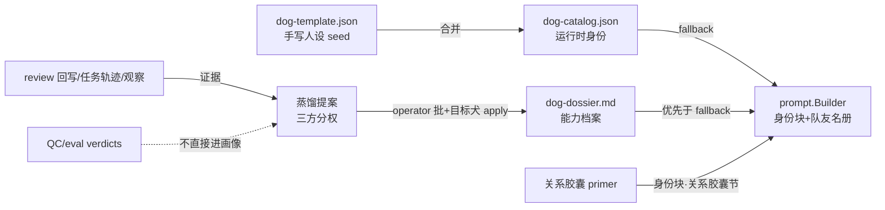
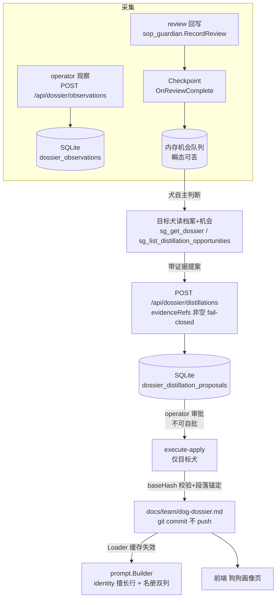
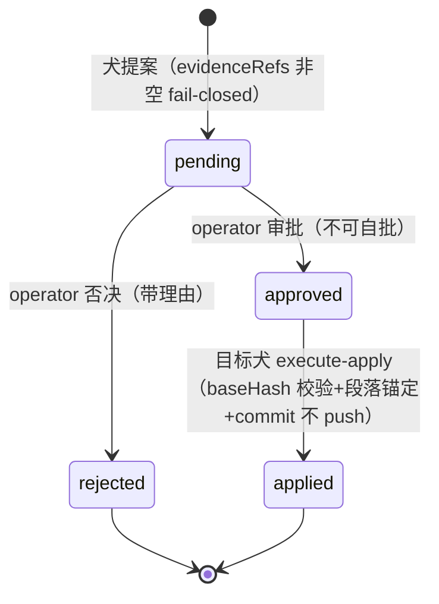

# [FT-DS-001] [Tech Story] 狗狗能力画像档案（Dog Dossier）：特性全景 × 子系统交付

> 本文档双职责：**上半部分（§1–2）是 SG"大模型性格/能力画像"特性的全景梳理**——四层拼图与层间边界，面向维护/评审/onboarding；**下半部分（§3 起）是 L2 能力档案子系统的交付 spec**——蒸馏提案流水线的模块、API、AC 与护栏。
> 数据来源：全部实读 `packs/default/breeds/dog-template.json`、`internal/dossier/`（全包）、`internal/transport/dossier_handler.go`、`internal/prompt/builder.go`、`internal/domains/sop/services/sop_guardian.go`、`internal/settings/profile.go`、`internal/eval/`、`internal/platform/platform.go`、`web/src/components/settings/DogDossierPanel.tsx`，及上游参考 `readonly-docs/clowder-ai`（骨架对齐 clowder-ai F208/cat-dossier，按 SG 惯例重写），非印象。

---

## 1. 元信息与背景 (Context & Value)

- **类型**: [x] Tech Story（梳理 + 新子系统交付，含前端）
- **责任人**: Dev: @bianmu | Reviewer: 跨犬 review（灵缇 xigou）
- **复杂度**: L（新域 + prompt 注入链改造 + SOP 挂接 + MCP 面 + 前端）
- **目标**:
  - As a **维护者 / 评审者 / 传球中的任意犬**,
  - I want to **一张图看清"画像数据从哪来、怎么沉淀、怎么影响行为、什么禁止做"，且复杂传球前能读到队友的证据化画像（强项/坏直觉/反信号/熔断信号）**,
  - So that **路由依据从"配置里一行手写人设"升级为"带 provenance、随真实任务演化的档案"，且改动任何一层都能定位上下游、不破坏证据链与审批治理**。

### 1.1 核心设计立场（继承 clowder eval 宪法 E1/E5）

1. **没有问卷式性格测试**。画像 = 手写人设打底 + 真实任务证据持续校准，不存在"给模型发测试卷统计分数"的机制。
2. **禁止性格维度总分**（"性格分必被表演"）。度量单位是 episode（事件），不是存在者。
3. **总结层永不算法生成**：犬提案 → operator 审批 → 目标犬应用，三方分权，每条结论带 provenance。
4. **分数不直接回灌 prompt**：注入的永远是一句话级摘要与路由边界，完整画像按需读文件（渐进披露）。

## 2. 特性全景：四层拼图

| 层 | 回答的问题 | 真相源 | 写入路径 | 消费方 |
|---|---|---|---|---|
| **L1 人设层**（静态身份） | 这只狗是谁、什么性格、什么职责 | `packs/default/breeds/dog-template.json`（seed）→ `.sounds-great-ai/dog-catalog.json`（运行时真相） | operator 手写（配置变更需人介入，铁律 3） | prompt.Builder 身份块/名册（回退源）、TTS 声线、前端成员管理 |
| **L2 能力档案层**（证据画像） | 它强在哪/弱在哪/什么球该传/什么球别传 | `docs/team/dog-dossier.md`（git 版本化） | **唯一写路径 = 蒸馏提案审批流**（本文 §3） | prompt 名册双列（擅长/路由边界）、前端狗狗画像页、传球/handoff 时按需读全文 |
| **L3 关系画像层**（犬×人私人画像） | 它与 operator 的长期关系如何 | `.sounds-great-ai/profiles/<operator>/relationship/<key>-primer.md` | propose → operator 审批 / 会话封口自动蒸馏（详见 FT-PI-001） | prompt 身份块"关系胶囊"（300 rune 上限） |
| **L4 行为评估层**（episode 度量） | 系统各域健康度如何 | `docs/eval-results/{verdicts,bundles}/` + `qc-metrics.jsonl` | eval 域调度 + QC 7 步遥测 | Eval Hub、eval:qc 域聚合——**评估结论不直接进画像**，须经 L2 蒸馏提案引用为证据 |

**层间数据流**：

### 2.1 L1 人设层锚点

- 字段定义：`pkg/pack/breed.go:91`（`BreedConfig.Personality/RoleDescription/TeamStrengths/Caution/Restrictions` + 两级 `dog_id`：品种级 `BreedConfig.DogID` / 变体级 `Variant.DogID`）
- 加载：`pkg/pack/loader.go:55` → `internal/platform/breeds_merge.go:30` 深合并进 `.sounds-great-ai/dog-catalog.json`（`internal/settings/file_store.go:23`，原子写 + 5 份 .bak）
- roster evaluation（`dog-template.json roster.*.evaluation`）：持久化于 dog-catalog 供 review 选择/路由用，**不进 prompt**——prompt 里的"队友名册"是 Builder 从 breeds map 动态生成的另一回事

### 2.2 L3 关系画像层（摘要，详见 FT-PI-001）

`internal/settings/profile.go` `RelationshipCapsule`（300 rune 上限）+ `internal/transport/profiles_handler.go:75` `Routes()`（propose/approve/reject/distill/AutoDistillSession）。与 L2 的边界：**L3 是犬×operator 的私人关系（per-operator 分区），L2 是团队能力画像（进名册路由、全员可见）**。两者共用"提案-审批"治理形态但目标文件、语义、审批粒度不同（对齐 clowder KD-16 的隔离决策）。

### 2.3 L4 行为评估层（摘要）

`internal/eval/`（domain/runner/scorer/verdict/closure/scheduler/store，verdict 写 `docs/eval-results/`）+ QC 遥测（`cmd/qc` → `qc-metrics.jsonl`）。**边界铁律：eval verdict 与 QC 指标不直接写入画像**——它们是 L2 蒸馏提案 `evidenceRefs`（type=review/trajectory）的证据来源之一，晋升总结层必须走审批流。

---

## 3. L2 子系统：架构与数据流（交付 spec）

**档案格式**（`docs/team/dog-dossier.md`）：每犬一节 `### {名} · @{mention} · `dog:{dogId}``，节内 yaml 围栏块 `# structured-profile: dog:{dogId}` 携带机器可读投影（oneLiner / l0RosterSummary / l0RoutingNote / routingSignals{peakCapabilities, antiSignals} / provenance），散文部分是六字段画像（原生峰值/被低估能力/坏直觉/召唤反信号/互补&反模式/翻车熔断信号）。当前 14 个 dogId（6 主犬 + 8 通道变体），v0.1 全部标 "baseline 手写人设，待证据校准"。

**蒸馏闭环状态机**（证据 → 总结层的唯一通道）：

### 3.1 模块清单（代码锚点）

| 模块 | 文件 | 职责 |
|---|---|---|
| 档案真相源 | `docs/team/dog-dossier.md` | 见上节格式定义 |
| 解析器 | `internal/dossier/profile.go:50` | 手写 yaml 围栏块解析（零依赖）；entityId 与标记不一致 fail 该块 |
| 加载器 | `internal/dossier/loader.go` | 进程缓存（未找到不缓存）；`Reader` 实现 prompt.DossierReader（结构化类型） |
| 观察暂存 | `internal/dossier/observation_store.go` | SQLite 表 `dossier_observations`（永久）；只进暂存层，唯一晋升路径是被提案引用为证据 |
| 机会层 | `internal/dossier/checkpoint.go:174` | 内存 store（瞬态设计——提醒可丢，账本不可丢）；sourceId 幂等 + in-flight 去重 |
| 提案契约 | `internal/dossier/proposal.go:88` | sourceEvent 白名单（review-complete/feat-phase-close/manual）；evidenceRefs 非空 fail-closed；状态机 pending→approved/rejected→applied |
| 提案账本 | `internal/dossier/proposal_store.go` | SQLite 表 `dossier_distillation_proposals`，sourceId 唯一索引，CAS 状态迁移 |
| 应用器 | `internal/dossier/applier.go:53` | PrepareDraft 纯函数：approved 门 → SHA-256 baseHash 乐观锁 → `dog:{id}` 段落锚定（拒绝跨段/无锚替换）→ 结构化 commit message |
| 服务编排 | `internal/dossier/service.go:99` | 三方分权（createdBy≠approvedBy、apply 仅 targetDogId）；execute-apply：写文件→git add+commit（失败回滚文件+reset index，**不 push**）→markApplied→Loader 缓存失效 |
| HTTP 面 | `internal/transport/dossier_handler.go:42` | 11 端点（§4）；actor 解析：body actor > X-SG-Actor > operator |
| SOP 挂接 | `internal/domains/sop/services/sop_guardian.go:69` `SetReviewCompleteListener` → `platform.go:416` | RecordReview 成功后 best-effort 触发（recover 包裹，永不阻塞 handoff 判定） |
| MCP 面 | `internal/mcp/governance/catalog.go`（dossier 族 4 工具） | sg_get_dossier / sg_get_dossier_base_hash / sg_list_distillation_opportunities / sg_propose_dossier_distillation |
| 前端 | `web/src/components/settings/DogDossierPanel.tsx` | settings「狗狗画像」分节：覆盖概览 + 模型分组卡片（provenance badge + 路由信号）+ 观察提交 + 机会处置（忽略/关联提案转化，2026-08-22 接入）+ 提案审批 |

## 4. 注入链（画像如何影响行为）

`internal/prompt/builder.go`：

1. **身份块**（`buildIdentity`，builder.go:222）：`**性格：**`（L1 手写人设，永不覆盖——性格是品牌设定）+ `**职责：**`（L1）+ `**擅长：**`（**L2 oneLiner 优先**，builder.go:263，回退 L1 team_strengths）
2. **队友名册**（`buildRoster`，builder.go:352）：双列——擅长列走 `L2 l0RosterSummary → L1 team_strengths → variant strengths → role_description`（builder.go:377）；路由边界列走 `L2 l0RoutingNote → L1 caution + 硬限制`（builder.go:399，restrictions 永远保留——config 是 enforcement，档案是 advice）
3. **dogId 解析**（builder.go:424 `dogIDOf`）：breed 级 dog_id 优先，回退 breed id
4. **压缩免疫**：Builder 产物经 `internal/transport/helpers.go:56` `injectHooks` 进入 L0 通道（claude/codex 原生 `--append-system-prompt`）

注入量刻意极小：名册每犬两格一句话；六字段全文不进 prompt，犬在复杂传球/handoff 时按需读 `docs/team/dog-dossier.md`（渐进披露，对齐 clowder L0 只放指针的设计）。

## 5. HTTP API（全部挂 `/api/dossier`）

| 方法与路径 | 职责 | 关键治理 |
|---|---|---|
| GET `/api/dossier` | 画像 × catalog join，按 model 分组 + coverage | 只读 |
| GET `/api/dossier/base-hash` | 当前档案 SHA-256（提案创建用） | 只读 |
| POST/GET `/api/dossier/observations` | 观察写入/列表（?dogId= 过滤） | 写暂存层，永不覆盖总结层 |
| GET `/api/dossier/distillation-opportunities` | 机会列表 | operator 全量；犬 actor 只看指向自己的；FE：`dossierService.listOpportunities`（2026-08-22 接入） |
| POST `…/opportunities/{id}/dismiss` \| `/convert` | 忽略 / 标记已转提案 | 仅目标犬或 operator；FE：`DogDossierPanel` 机会分节——忽略一键、转化需填关联提案 ID（提案由狗狗经 `POST /api/dossier/distillations` 或 MCP `sg_propose_dossier_distillation` 创建，operator 只做关联标记） |
| POST `/api/dossier/distillations` | 创建提案（sourceId 幂等，命中 200/新建 201） | evidenceRefs 空=400 fail-closed |
| GET `/api/dossier/distillations`（?dogId=） | pending 列表 / 指定犬全量 | — |
| GET `…/distillations/{id}` | 提案详情 | — |
| POST `…/distillations/{id}/approve` \| `/reject` | 审批/否决 | createdBy==actor → 403（职责分离） |
| POST `…/distillations/{id}/execute-apply` | 应用：校验→写文件→commit（不 push） | 仅 targetDogId → 否则 403；baseHash 不符 → 409 |

## 6. 验收标准 (AC)

### 6.1 全景边界（梳理型）

- [x] 四层拼图各有唯一真相源与明确写入路径，本文锚点全部可回源（file:line）
- [x] 总结层唯一写路径 = 蒸馏提案状态机（三方分权 + evidenceRefs fail-closed + baseHash 乐观锁 + 段落锚定），无旁路
- [x] 评估层数据与画像层单向隔离（eval/QC → 证据引用 → 审批，无直写）
- [x] 注入链 fallback 语义明确（L2 优先、L1 兜底、restrictions 永存）且双切源（identity + roster）同步
- [x] 无性格分数端点/指标；prompt 注入仅摘要级

### 6.2 子系统交付

- [x] **AC-A（档案与注入）**: dog-dossier.md 14 个 dogId 条目全部解析通过；builder 双切源——identity 擅长行与名册双列在 dossier 有值时优先、缺值时回退 config（单测覆盖）
- [x] **AC-B（观察暂存）**: POST 观察 → SQLite 永久存储 → 只能作为证据被提案引用；空 dogId/content 400
- [x] **AC-C（触发器）**: sop_guardian RecordReview 成功 → 机会创建（幂等：同 thread+sha+reviewer 只一条）；机会瞬态（进程重启可丢，by design）
- [x] **AC-C2（机会前端闭环，2026-08-22）**: `DogDossierPanel` 机会分节列出 pending 机会（sourceEvent/targetDogId/threadId/时间），支持忽略与关联提案 ID 标记转化——机会管线三个端点全部有前端消费者（此前 `GET …/opportunities` 及 dismiss/convert 为前端断档）；契约由 `dossierService.test.ts` 锁定
- [x] **AC-D（提案状态机）**: pending→approved/rejected→applied CAS 迁移；自批/自否 403；非目标犬 apply 403；sourceId 幂等
- [x] **AC-E（应用器安全）**: baseHash 不符 409 拒绝且文件不动；beforeSnapshot 只在目标犬段内替换（跨段同文案测试）；段头缺失 fail-closed；commit 失败回滚文件+index
- [x] **AC-F（MCP）**: dossier 族 4 工具进 catalog，baseline/attestation 已再生（17 tools）
- [x] **AC-G（前端）**: settings「狗狗画像」分节：覆盖概览、模型分组卡片、provenance badge、观察提交、提案 approve/reject
- [x] **AC-H（宪法合规）**: 无性格分数端点；画像注入仅一句话摘要级（完整六字段按需读文件）；观测数据不直接回灌 prompt

## 7. 工程护栏与铁律合规

- **不碰保护区**：不修改 `.sounds-great-ai/`、`internal/config/`；`docs/team/dog-dossier.md` 是仓库文档（git 版本化 = 天然审计日志），不是运行时配置
- **存储**：只增两张 SQLite 表（`CREATE TABLE IF NOT EXISTS`）；测试用 `t.TempDir()` 临时实例 + 内存 factory 回退
- **git**：execute-apply 只 `add+commit` 不 push——推送走正常 SOP 流程；两阶段回滚防脏 index
- **明确不做**：性格维度打分 / 算法路由 / verdict 直接注入 prompt（对齐 clowder E1/E5）

## 8. 后续迭代（登记不遗失）

1. feat-phase-close 自动挂接（当前白名单保留、仅 manual + review-complete 有触发路径）
2. Loader 缓存的文件 watcher 失效（当前 apply 后显式失效 + 重启刷新）
3. L4 → L2 证据自动聚合建议（eval verdict 周期性生成"值得蒸馏"提示，仍走提案审批）
4. 提案结构化字段级 diff（当前整段文本对照）+ 观察证据回链（evidenceRef → 观察详情/线程锚点跳转）
