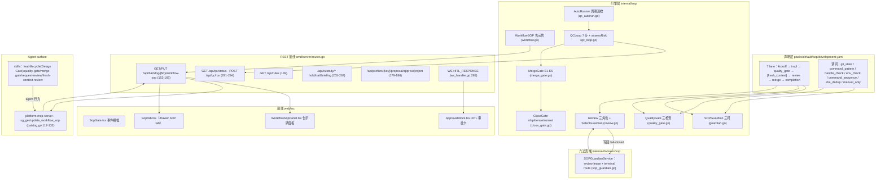

# [FT-SOP-001] [Tech Story] Collaborative Discipline（协作纪律：SOP 引擎 + 告示牌 + 质量门禁 + 评审体系）代码级逻辑梳理

> 本文是 **代码级逻辑梳理 Story**，非新需求交付。目标：把 sounds-great-ai 的 Collaborative Discipline 能力一次性讲清——从 `packs/default/sop/development.yaml` 的声明层，到 `internal/sop/` 引擎层（告示牌 / Guardian / Quality Gate / Merge Gate / Close Gate / Review / QC 循环），再到 REST 接线、六边形域、前端面板与 agent surface（MCP + skills），作为后续维护 / 评审 / onboarding 的真相源。
> 数据来源：全部实读代码，带 `文件:行号` 锚点，非印象。
> 代码实况基准：**2026-08-21**（含告示牌 REST/MCP/前端接线完成日）。

---

## 1. 元信息与背景 (Context & Value)

- **类型**: [x] Tech Story（架构/逻辑梳理，既有系统）
- **责任人**: Dev: @bianmu（梳理） | Reviewer: 跨犬 review
- **复杂度**: L（声明层 + 引擎 8 个子系统 + 六边形域 + REST + 前端 + MCP + skills）
- **目标**:
  - As a **狗狗队伍（The Pack）与开发者**,
  - I want to **让「多只狗狗协作」拥有可声明、可执行、可审计的纪律：立项设计门禁 → 实现隔离 → 质量自检 → 独立评审 → 合并门禁 → 愿景守护收尾，且协作状态（阶段/接力棒/续接胶囊/检查证明）对外可见**,
  - So that **任何 feature 从立项到 close 都走同一条纪律链，跨会话接力不丢上下文，机器能验证的部分全自动、不能验证的部分显式降级给人，而不是靠信任。**

### 1.1 特性拼图（子系统 → 代码落点）

| 子系统 | 关注点 | 核心代码 | 说明 |
|--------|--------|----------|------|
| SOP 声明层 | 阶段 lane 目录 + 机器可查规则 | `packs/default/sop/development.yaml`、`internal/sop/definition.go` | 7 lane，risk-routed 非强制串行 |
| 谓词引擎 | 机器可执行的规则检查 | `internal/sop/predicate.go` | 7 种谓词：git_state / command_pattern / handle_check / env_check / command_sequence / sha_dedup / manual_only |
| 告示牌 | 跨会话接力状态（信息共享非流程控制） | `internal/sop/workflow.go` + `internal/transport/workflow_sop_handler.go` | Redis CAS + 内存降级；REST GET/PUT |
| Guardian | 愿景守护三问 + A2A 深度熔断 | `internal/sop/guardian.go` | spec / tests / VISION 三问全机器可执行 |
| Quality Gate | 自检三检查 | `internal/sop/quality_gate.go` | spec_alignment / evidence_before_claim / vision_coverage |
| Merge Gate | 合并前 E1-E5 门禁 | `internal/sop/merge_gate.go` | review 存在性 + 跨犬独立性 + 质量 + 干净树 + 测试 |
| Close Gate | 收尾三向裁决 | `internal/sop/close_gate.go` | ship / iterate / sunset + 报告持久化 |
| Review 体系 | 三角色面板 + 写回 fail-closed | `internal/sop/review.go` | L1 hygiene / L2 reviewer / L3 approver；dog_id 级身份 |
| QC 循环 | 7 步自动化质检 | `internal/sop/qc_loop.go` + `qc_state.go` + `qc_metrics.go` | 风险分层 + 状态持久化 + JSONL 遥测 |
| server 自动触发 | 后台周期巡检 + 端点 | `internal/sop/qc_autorun.go` + `cmd/server/routes.go:291-294` | 仓库健康心跳 |
| 六边形域 | 运行时 review lease + terminal route | `internal/domains/sop/services/sop_guardian.go` | A2A 手递手强制 |
| 前端 | 事件级 + 面板级协作 UI | `web/src/components/workspace/{SopGate,ApprovalBlock,WorkflowSopPanel}.tsx` + `tabs/SopTab.tsx` | SOP 触发横幅 / HITL 审批 / 告示牌面板 |
| Agent surface | 平台即 MCP + skills | `internal/mcp/governance/catalog.go`（sop 家族）+ `packs/default/skills/` | 13 工具 6 family；feat-lifecycle 含 Design Gate |

---

## 2. 系统全景与数据流



**关键事实**：告示牌（`WorkflowSOP`）是**信息共享，不是流程控制**——它外化 stage / baton_holder / next_skill / resume_capsule / checks，让接力在冷启动与上下文压缩后仍可续接，但狗狗自己决定行为，告示牌不阻塞任何动作（`workflow.go:40-52` 注释、`catalog.go:117-119`）。真正的**硬门禁**只在两处：合并前（`MergeGate` E1-E5）与 feature close 前（`CloseGate` + `SOPGuardian.SignOff`）。

---

## 3. 声明层：development.yaml（7 lane + 谓词体系）

`packs/default/sop/development.yaml` 定义 lane 目录，**不是强制串行流水线**（`development.yaml:4-7`：risk-routed，狗狗按行为/数据/安全/契约/不可逆性风险自选 lane）：

| lane | 标签 | suggested_skill | 关键 blocker 规则（id） | 谓词 |
|------|------|-----------------|------------------------|------|
| kickoff | 立项（按需） | feat-lifecycle | kickoff-ac-checklist（AC+需求点清单） | manual_only |
| impl | 实现隔离（按需） | worktree | impl-main-sync-before-worktree（main 双向同步）/ impl-redis-port-only（Redis 指定端口）/ impl-risk-route-before-action | git_state / env_check / manual_only |
| quality_gate | 自检（按风险） | quality-gate | quality-gate-vision-coverage / quality-gate-risk-matched-evidence（声称完成须有匹配证据） | manual_only / command_pattern(`go test\|go build\|go vet`) |
| fresh_context | Fresh-Context Pre-Review（**可选**） | fresh-context-review | 无 blocker；pitfall fresh-context-not-approval（finding generator 不是 approval authority，不产 verdict、不记入 Review Provenance） | manual_only |
| review | 独立验证（按风险择源） | request-review | review-no-self-review（同一体不能 review 自己）/ review-cross-breed（跨犬优先，warn） | handle_check(reviewer_not_author / cross_breed_preferred) |
| merge | 合入（载体触发） | merge-gate | merge-squash-only（必须 squash）/ merge-review-sha-dedup（同 SHA 不重复触发） | command_pattern / sha_dedup |
| completion | 愿景守护（终态触发） | feat-lifecycle | completion-vision-guardian（用户可见/愿景变化须独立守护）/ completion-merged-and-tested / completion-missing-guardian-handoff | manual_only / command_sequence / handle_check(guardian_handoff_present) |

**谓词执行**：`internal/sop/predicate.go` 的 `PredicateExecutor.Execute`（`predicate.go:63-82`）按 `Predicate.Type` 分发 7 种机器检查；未知类型默认放行（`predicate.go:80`）。git/env 通过 `GitRunner`/`EnvGetter` 注入（`predicate.go:22-51`），保证可测试性。

**声明加载**：`internal/sop/definition.go` — `LoadDefinition`（`definition.go:80-90`）、`FindStage`（`definition.go:93-100`）、`BlockerRules`（仅 severity=blocker，`definition.go:103-111`）、`StageIDs`（有序 lane 列表，`definition.go:114-120`）。

---

## 4. 引擎层：告示牌 WorkflowSOP（internal/sop/workflow.go）

**状态模型**（`workflow.go:13-38`）：`WorkflowState` = feature_id / stage / baton_holder / next_skill / resume_capsule / checks[]。`WorkflowCheck` = name / status（`attested` 声明 vs `verified` 机器验证 vs `unknown`）/ at。

**规则驱动状态机**（非硬编码 DAG，`workflow.go:44-52`）：

```
kickoff → impl → quality_gate → [fresh_context] → review → merge → completion
                    └───────────→ review（fresh_context 可选跳过）
        review → impl / merge → review（可回退）
```

`IsValidTransition`（`workflow.go:55-69`）：空起始只允许 kickoff。

**存储双轨**（`workflow.go:71-97`）：`NewWorkflowSOP` 优先 Redis（`Ping` 探测，失败自动降级内存）；`useMemory` 为 true 时用 map + RWMutex。Redis key 前缀 `sop:workflow:`（`workflow.go:100`）。

**CAS 写**（`workflow.go:135-191`）：`SetState(state, expectedStage)` 内存版比对现有 stage（`setMemory:144-157`）；Redis 版用 `WATCH` + 事务（`setRedis:159-191`）。stage 不匹配 → `ErrConcurrentModification`（`workflow.go:268`）。

**操作原语**：
- `TransitionStage`（`workflow.go:194-214`）：新 board 必须 kickoff；旧 board 走状态机校验 + CAS。
- `AttestCheck` / `VerifyCheck`（`workflow.go:217-250`）：按名 upsert check（`upsertCheck:257-265`）。
- `Resume`（`workflow.go:253-255`）：冷启动读回续接状态。

---

## 5. 引擎层：Guardian / Quality Gate / Merge Gate / Close Gate

### 5.1 SOPGuardian 愿景守护（guardian.go）

- `SOPGuardian`（`guardian.go:27-37`）：gates 数组 + `maxA2ADepth`（默认 3）。
- `CheckA2ADepth`（`guardian.go:39-44`）：A2A review 轮数 ≥ 上限 → `EscalateToCVO`（升级人类裁决），`Continue` 否则。
- `SignOff` 三问（`guardian.go:71-89`，**全机器可执行、零 LLM 调用**）：
  1. `checkHasSpec`（`guardian.go:92-127`）：`docs/superpowers/specs/` 下存在匹配 feature 名的 spec 文件；
  2. `checkHasTests`（`guardian.go:130-142`）：`go test` 退出码；
  3. `checkVisionCompatibility`（`guardian.go:145-187`）：spec 文件含 "VISION Compatibility"。
- `RequiresGuardianSignOff`（`guardian.go:191-193`）：stage=completion 时强制。

### 5.2 QualityGate 自检（quality_gate.go）

`Run` 三检查（`quality_gate.go:45-60`）：
- `checkSpecAlignment`（`quality_gate.go:63-75`）：spec 文件存在；
- `checkEvidenceBeforeClaim`（`quality_gate.go:78-86`）：声称完成前必须有 commits + tests；
- `checkVisionCoverage`（`quality_gate.go:89-106`）：spec 含 VISION 兼容段。
另提供 `RunTests` / `RunBuild`（`quality_gate.go:110-137`），被 Guardian 三问的 tests 检查复用。

### 5.3 MergeGate 合并门禁（merge_gate.go）

`Run`（`merge_gate.go:57-78`）先 `AssessRiskFromFiles` + `RiskRouter.Route` 决定 track，再跑 E1-E5（**任一不过即 fail-closed**）：

| 条件 | 检查 | 代码 |
|------|------|------|
| E1 | review 存在（本地 peer SHA 或云 review SHA 至少其一，且 ReviewCycle 有记录） | `merge_gate.go:81-95` |
| E2 | 跨犬独立性：本地 review 须为跨 dog_id（`IsCrossBreedReview`）或云 review 绑定当前 HEAD；意图不明 → fail-closed | `merge_gate.go:103-168` |
| E3 | quality gate 已过 | `merge_gate.go:171-176` |
| E4 | 无未提交改动 | `merge_gate.go:179-184` |
| E5 | 测试通过 | `merge_gate.go:187-192` |

`CheckGitClean`（`merge_gate.go:195-208`）提供独立脏树检查。

### 5.4 CloseGate 收尾裁决（close_gate.go）

- `Resolution`：ship / iterate / sunset 三向（`close_gate.go:11-18`）。
- `determineResolution`（`close_gate.go:82-104`）：Quality + Merge + Guardian 全过且 AC 全过 → **ship**；Guardian 明确失败且 AC 不过 → **sunset**；否则 **iterate**。
- `Generate` / `Persist` / `Load`（`close_gate.go:67-155`）：报告 JSON 落 `docs/superpowers/close-reports/`（`close_gate.go:107-125`）。

---

## 6. 引擎层：Review 体系（review.go）

**身份粒度 = dog_id**（variant 级，狗狗 + 绑定 CLI），非 breed 标签——`ReviewCycle` 用 `AuthorDogID` / `AssignedReviewerDogID` 校验（`review.go:193-204`）。

### 6.1 三角色面板（L1/L2/L3）

`SelectReviewPanel`（`review.go:136-157`）：
- 先 `SelectReviewerFromBreeds` 选 L2 reviewer（`review.go:72-119`：过滤 author 自身/不可用/同 CLI(策略)/不在 can_review，偏好跨犬）；
- **先把 reviewer 从候选剔除，再选 L3 approver**（`review.go:141-155`）→ `FinalApprover` 物理上不能等于 `Reviewer`，也不能等于 author。

### 6.2 写回 fail-closed（RecordReview）

`RecordReview`（`review.go:245-263`）按 dog_id 拒绝三种违规：
- `ErrReviewNoIdentity`（无 reviewer 身份，`review.go:349`）
- `ErrSelfReview`（reviewer == author，`review.go:352`）
- `ErrWrongPrincipal`（非指派狗狗写 verdict，`review.go:356`）
- `ErrWrongCarrier`（verdict 写回非指派线程，`review.go:360`）

### 6.3 愿景守护选择原语（SelectGuardian）

`SelectGuardian`（`review.go:165-184`）：排除 author + reviewer + 不可用；**跨 CLI 候选优先**（独立模型族），同 CLI 仅作降级回退；全部不可用 → `ErrNoGuardianAvailable`（`review.go:187`）。

### 6.4 Reviewer Delta 度量

`ComputeReviewerDelta`（`review.go:321-338`）：正则 `\[(?i)(?:delta|fc):(covered|new|n/?a)\]` 解析评审注释中的发现标记（`review.go:316`），`Ratio = New/(New+Covered)`（`review.go:333-336`）量化跨模型评审增量价值。

---

## 7. 引擎层：QC 7 步循环 + 状态 + 遥测 + 自动巡检

### 7.1 风险分层（assessRisk）

`assessRisk`（`qc_loop.go:87-97`）：无文件清单 → `full`；触碰 `.go` → `full`；仅 docs/md → `light`（跳过 review/evidence/ci 三步，`qc_loop.go:110-119`）。

### 7.2 7 步循环（qc_loop.go:100-154）

| 步 | 名称 | 代码 | 行为 | light 层 |
|----|------|------|------|---------|
| 1 | hygiene | `qc_loop.go:159-192` | `gofmt -l` 检测；`--fix`→`gofmt -w`；`--fix-commit`→`[qc-bot]` 提交（fix 前工作区已脏则拒绝吞 WIP） | ✅ |
| 2 | fresh_context | `qc_loop.go:195-206` | 无先验上下文评审；reviewer==author → fail | ✅ |
| 3 | cross_breed_review | `qc_loop.go:210-229` | L2≠author、L3≠author 且 ≠reviewer | ⏭ |
| 4 | evidence_manifest | `qc_loop.go:232-242` | 跟踪改动文件数 | ⏭ |
| 5 | ci_repair | `qc_loop.go:247-273` | `go build ./...` + `go test ./...`（无 go.mod 则 advisory 跳过） | ⏭ |
| 6 | verdict | `qc_loop.go:277-289` | 真实聚合前 5 步，任一失败即 fail（非静默 pass） | ✅ |
| 7 | sign_off | `qc_loop.go:292-312` | `SOPGuardian.SignOff` 三问 | ✅ |

`ServerMode`（`qc_loop.go:48-52`）：server 心跳运行时 step2/3/7 降级 advisory（review/guardian 是人的门禁，心跳只 fail 真实 hygiene/CI 问题）；`SkipHeavy` 跳过 ci_repair。

### 7.3 状态持久化 + 遥测

- `qc_state.go`：`LoadQCState` / `SaveQCState` / `ComputeStale`（HEAD 变化 → stale）；run 后写入 reviewedSha / idempotencyKey / staleFlag / phase（`qc_loop.go:141-152`）。
- `qc_metrics.go`：逐次 JSONL 追加（`RecordQCMetrics`）+ 聚合（`AggregateQCMetrics`），喂 eval:qc 域。

### 7.4 AutoRunner（server 自动触发）

`AutoRunner.Start`（`qc_autorun.go:45-70`）：启动 5s 后首跑 + interval 周期跑（`interval<=0` 仅按需）；`RunNow`（`qc_autorun.go:75-102`）以 `ServerMode:true` 跑一轮并写遥测，供 `GET /api/qc/status` / `POST /api/qc/run?heavy=1` 调用（`routes.go:291-294`）。

---

## 8. 六边形域：review lease + terminal route（internal/domains/sop/services/sop_guardian.go）

`SOPGuardianService`（`sop_guardian.go:21-37`）适配 `IA2AGuardian` 端口，**不加新逻辑只做类型翻译**；核心是运行时 A2A 手递手强制：

- `EnforceReviewHandoff`（`sop_guardian.go:157-238`）三层校验：
  1. **基线不变式**：dog 不能把自己的作品交给同 dog_id 评审 → 直接拒绝（`sop_guardian.go:163-168`）；
  2. **声明式 blocker**：`evalReviewBlockers`（`sop_guardian.go:272-294`）用 `development.yaml` 的 `review` stage blocker hard_rules（reviewer_not_author 等）+ `PredicateExecutor` 实算；
  3. **review lease**：首次跨犬 handoff 发 lease（`sop_guardian.go:186-202`，含 generation）；把作品交还 author 的 handoff 视为写回，走 `preflightReviewTerminalRoute`（`sop_guardian.go:250-268`，五种 fail-closed 原因：predecessor_route_missing / generation_mismatch / reviewer_not_holder / holder_thread_mismatch / target_thread_mismatch），通过后经 `ReviewCycle.RecordReview` 落账（`sop_guardian.go:216-231`）。
- `reviewKey`（`sop_guardian.go:310-315`）按 (a,b) 排序拼接，assignment/write-back 可跨发起方关联。
- `resolveSOPDefinition`（`sop_guardian.go:88-119`）：显式路径 → `SG_SOP_DEFINITION` env → 上溯目录树找 `packs/default/sop/development.yaml`。

---

## 9. REST 接线（cmd/server/routes.go）

| 端点 | 方法 | 处理器 | 认证 | 用途 |
|------|------|--------|------|------|
| `/api/backlog/{itemId}/workflow-sop` | GET/PUT | `WorkflowSOPHandler`（`workflow_sop_handler.go:29-34`） | ✅ auth.Wrap（`routes.go:165`） | 告示牌读写 |
| `/api/rules`、`/api/prompt-injection/*` | GET | `RulesHandler`（`routes.go:148-150`） | — | 规则/钩子清单 |
| `/api/qc/status`、`/api/qc/run` | GET/POST | `QCStatusHandler`/`QCRunHandler`（`routes.go:291-294`） | ✅ | QC 心跳 + 按需 |
| `/api/custody/holds/{tid}/webhook` | POST | `CustodyWakeHandler`（`routes.go:259`） | ✅ operator 级 | hold_ball 外部唤醒 |
| `/api/custody/threads/{tid}/trail` | GET | `CustodyTrailHandler`（`routes.go:263`） | — | 接力流水投影 |
| `/api/custody/briefing` | GET | `CustodyDutyBriefingHandler`（`routes.go:267`） | ✅ | 全线程 duty 快照 |
| `/api/profiles/{key}/propose` / `proposal` / `proposal/approve` / `proposal/reject` | POST/GET | `ProfilesHandler`（`profiles_handler.go:81-84`） | ✅ | **Approval Hub**：关系胶囊候选 → 人工裁决 |
| `/api/skills/security/{id}/approve` | POST | `SkillsHandler.securityApprove`（`skills_handler.go:39`） | ✅ | skill 安全审批 |
| `/api/memory/lanes/{id}/approve` / `reject` | POST | `LanesHandler`（`lanes_handler_test.go:40,79`） | ✅ | 共享记忆 truth 审批 |
| WS `HITL_RESPONSE` | — | `ws_handler.go:283` | — | 审批卡实时回传（ApprovalBlock） |

**告示牌 handler 校验链**（`workflow_sop_handler.go:75-146`，按序）：合法 JSON(400) → feature_id 匹配 itemId(422 `feature_mismatch`) → 新 board 必须 kickoff(400) → stage 转移合法(400) → `expected_stage` CAS(409 `concurrent_modification`)。写字段语义：空串 = 不改；checks 按名 upsert（`upsertWorkflowCheck:149-157`），可单条 attest 不重写整板。

---

## 10. 前端层（web/src）

| 组件 | 形态 | 数据 | 说明 |
|------|------|------|------|
| `SopGate.tsx`（8-22） | 事件级横幅 `[SOP Gate Triggered]` | WS 事件 `SopGateEvent` | 展示触发原因 + 规则号 `SOP-CROSS-REVIEW-02`；reason 缺省用 i18n `workspace.sopGate.defaultReason` |
| `ApprovalBlock.tsx`（10-53） | HITL 审批卡 | WS 事件 `ApprovalRequestEvent` | 影响描述 + 理由输入 + approve/reject → `sendHitlResponse`（WS `HITL_RESPONSE`） |
| `WorkflowSopPanel.tsx` | 告示牌面板 | `GET /api/backlog/{fid}/workflow-sop` | 7 阶 `StagePills`（当前/已过/未达三态，`WorkflowSopPanel.tsx:10-18,56-80`）、baton/next/resume（空白折叠）、checks 三态徽章（verified=emerald / attested=amber / unknown=slate，`WorkflowSopPanel.tsx:34-54`）；404 → 无告示牌提示 |
| `SopTab.tsx`（10-41） | drawer「SOP」tab | feature id 输入 → 面板 | SG 无 backlog 列表 UI 的精简形态 |
| 挂载 | `ToolPanel.tsx:31` | `activeDrawerTab === 'sop'` | `DrawerTabType` 增 `'sop'`（`types/index.ts`） |

类型契约：`web/src/types/api.ts:523-539`（`WorkflowCheckStatus` / `WorkflowCheck` / `WorkflowSopState`，snake_case 对齐后端 JSON）。i18n：`workspace.sopPanel.*` 12 键（zh/en）。

---

## 11. Agent Surface（MCP + skills）

### 11.1 平台即 MCP（governance.Catalog()）

`internal/mcp/governance/catalog.go` 是唯一真相源，**13 工具 6 family**（collab 5 / memory 2 / people 1 / roster 2 / breeds 1 / **sop 2**），每个工具带 4 项治理注解（ReadOnly / Destructive / Idempotent / OpenWorld，`catalog.go:25-31`），sha256 baseline + attestation fail-closed，CI 拦截漂移。

**sop 家族**（`catalog.go:117-132`）：
- `sg_get_workflow_sop`：GET `/api/backlog/{itemId}/workflow-sop`，ReadOnly；
- `sg_update_workflow_sop`：PUT 同路径，BodyParams = feature_id / stage / baton_holder / next_skill / resume_capsule / expected_stage（CAS 语义 + 新板必须 kickoff，描述内嵌完整 stage 链与「信息共享非流程控制」）。

`cmd/platform-mcp-server/main.go` 的 `doRequest` 支持 GET/POST/PUT body 分支，`paramDescription` 为每个 body 参数提供中文语义描述。

### 11.2 skills（行为侧）

| skill | 纪律环节 |
|-------|---------|
| `feat-lifecycle` | 立项（愿景对照/feature 文件/BACKLOG 索引）→ **Design Gate（设计确认）** → 完成（quality→review→merge→AC 验收→close） |
| `quality-gate` | quality_gate lane 自检 |
| `merge-gate` | merge lane 门禁 |
| `request-review` | review lane 独立验证 |
| `fresh-context-review` | fresh_context 可选 lane（finding generator，非 approval） |
| `worktree` | impl lane 实现隔离 |

**Design Gate**（`feat-lifecycle/SKILL.md:30-65`，Discussion → 实现的必经关卡）：功能类型分流表（前端 UI/UX→operator wireframe / 纯后端→跨犬讨论 / 架构级→讨论+operator 拍板+决策矩阵 / Trivial→跳过）；前置侦查（读 features 索引 + Key Decisions + 历史讨论）；**User Journey 门禁**（用户可感知变化必须有已落盘 User Journey，否则 `user_journey_exempt: {reason}` 显式声明）；**不可逆决策对照一问**（AGENTS.md 铁律：不碰 internal/config/ 推理、不硬编码 DAG、不新建 A2A server、配置不可运行时改）；**OQ 升级规则**（先判可逆性，升级须附决策矩阵）；**元审美自检**（坐标变换 vs 多项式堆项）。

---

## 12. 前后端逻辑贯通（一图总览）

```
【写路径】agent 侧
  CLI agent ── MCP sg_update_workflow_sop ──► platform-mcp-server doRequest
        ──► PUT /api/backlog/{fid}/workflow-sop（auth）
              └─ WorkflowSOPHandler.PutWorkflowSOP：校验链 400/422/400/409
              └─ WorkflowSOP.SetState：Redis WATCH+CAS 或内存 CAS（ErrConcurrentModification）
        ──► state.UpdatedAt 刷新

【读路径】前端 + agent 冷启动
  SopTab(输入 fid) ──► WorkflowSopPanel ── GET /api/backlog/{fid}/workflow-sop（auth）
        ──► WorkflowSOP.GetState ──► StagePills / baton / next / resume / checks
  agent 冷启动 ── MCP sg_get_workflow_sop ──► 同 GET（Resume 语义）

【事件路径】运行时
  SOP Gate 触发 ── WS 事件 ──► SopGate 横幅（reason + 规则号）
  审批请求 ── WS ApprovalRequestEvent ──► ApprovalBlock ── sendHitlResponse
        ── WS HITL_RESPONSE（request_id/approved/reason）──► 运行时继续
```

**checks 可信度分层**：`attested` = agent 声明（判断力在 agent），`verified` = 机器验证（gofmt/go test 等退出码），`unknown` = 未定。前端按徽章着色区分，机器只标记可信度，不外包判断力。

---

## 13. 已实现清单与测试覆盖

- **告示牌**：`internal/transport/workflow_sop_handler_test.go` 8 例（404 / 更新与读回 / feature_mismatch 422 / CAS 冲突 409 / 非法转移 400 / 新板必须 kickoff 400 / attest check）。
- **状态机**：`internal/sop/workflow_test.go` 含 fresh_context 转移补测（quality_gate→fresh_context/review、fresh_context→review/impl、impl→fresh_context 与 fresh_context→merge 非法）。
- **Review**：`internal/sop/review_test.go` 三角色 + SelectGuardian 4 例（排除 author+reviewer / 跨 CLI 优先 / 同 CLI 降级 / 无候选）。
- **Guardian/QC/Close**：`internal/sop/` 既有测试覆盖三问 SignOff、7 步循环、风险分层、状态持久化、AutoRunner。
- **验收门禁**：`make qc`（`cmd/qc/main.go`，失败退出 1）+ `scripts/pre-merge-check.sh` + CI pre-merge job。
- 2026-08-21 起全链路 `go build`/`go vet`/`go test` + `web tsc -b`/`vite build` 全绿；MCP baseline 13 tools 无漂移。

---

## 14. 残留差异与后续（不阻塞，如实记录）

- **告示牌 checks 为自由 name 列表**：无固定键约束，前端按名称渲染——灵活但缺乏契约；后续可考虑对已知 check 名（如 remoteMainSynced / qualityGatePassed / reviewApproved / visionGuardDone）提供约定枚举。
- **resume_capsule 为自由文本 string**：结构化续接（goal/done[]/currentFocus）留待后续；当前由 MCP 描述引导写入胶囊文本。
- **Approval Hub 覆盖**：profile 胶囊 proposal 已有完整审批闭环；散落 thread 级审批聚合（统一审批中心）未实现，不阻塞本特性。
- **MergeGate 运行时接入**：`MergeGate` 目前仅在测试/工具中引用，server 无真实 git merge 挂载点——强制门禁由 `make qc`/CI 承担，server 侧为心跳 + 按需巡检（与 QC 自动触发同一决策）。
- **guardian 选择调用点**：`SelectGuardian` 原语已就绪，QCLoop step7 / close 流程当前沿用既有 guardian 路径，显式调用点留待编排侧接入。
